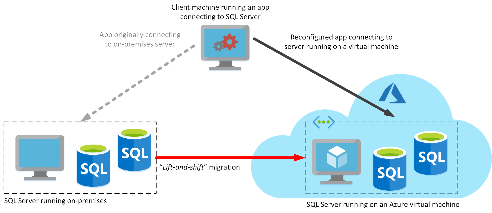
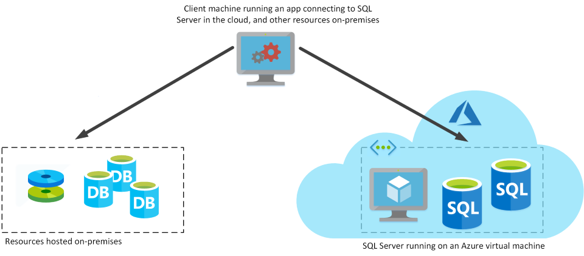

Microsoft SQL Server is a popular relational DBMS. It has a long history, and has features that provide database management to organizations of all sizes. In the past, organizations have run SQL Server on-premises. However, many organizations are now looking to shift operations on-line to take advantage of services available in the cloud. SQL Server offers several ways to run a database in Azure. In this unit, you'll look at moving SQL Server to an Azure Virtual Machine.

## What is SQL Server on Azure Virtual Machines?

SQL Server on Virtual Machines enables you to use full versions of SQL Server in the Cloud without having to manage any on-premises hardware. This is an example of the IaaS approach.

SQL Server running on an Azure virtual machine effectively replicates the database running on real on-premises hardware. Migrating from the system running on-premises to an Azure virtual machine is no different than moving the databases from one on-premises server to another.

In the example scenario described in the introduction, the database runs stored procedures and scripts as part of the database workload. If these stored procedures and scripts depend on features that are restricted by following a PaaS approach, then running SQL Server on your own virtual machines might be a good option. However, you remain responsible for maintaining the SQL Server software and performing the various administrative tasks to keep the database running from day-to-day.

This approach is suitable for migrations and applications requiring access to operating system features that might be unsupported at the PaaS level. SQL virtual machines are *lift-and-shift* ready for existing applications that require fast migration to the cloud with minimal changes. 

> [!NOTE]
> The term *lift-and-shift* refers to the way in which you can move a database directly from an on-premises server to an Azure virtual machine without requiring that you make any changes to it. Applications that previously connected to the on-premises database can be quickly reconfigured to connect to the database running on the virtual machine, but should otherwise remain unchanged.

### Use cases

This approach is optimized for migrating existing applications to Azure, or extending existing on-premises applications to the cloud in hybrid deployments.

> [!NOTE]
> A *hybrid deployment* is a system where part of the operation runs on-premises, and part in the cloud. Your database might be part of a larger system that runs on-premises, although the database elements might be hosted in the cloud.
>
> 

You can use SQL Server in a virtual machine to develop and test traditional SQL Server applications. With a virtual machine, you have the full administrative rights over the DBMS and operating system. It's a perfect choice when an organization already has IT resources available to maintain the virtual machines.

These capabilities enable you to:

- Create rapid development and test scenarios when you do not want to buy on-premises non-production SQL Server hardware.
- Become lift-and-shift ready for existing applications that require fast migration to the cloud with minimal changes or no changes.
- Scale up the platform on which SQL Server is running, by allocating more memory, CPU power, and disk space to the virtual machine. You can quickly resize an Azure virtual machine without the requirement that you reinstall the software that is running on it.

### Business benefits

Running SQL Server on virtual machines allows you to meet unique and diverse business needs through a combination of on-premises and cloud-hosted deployments, while using the same set of server products, development tools, and expertise across these environments.

It's not always easy for businesses to switch their DBMS to a fully managed service. There may be specific requirements that must be satisfied in order to migrate to a managed service that requires making changes to the database and the applications that use it. For this reason, using virtual machines can offer a solution, but using them does not eliminate the need to administer your DBMS as carefully as you would on-premises.
