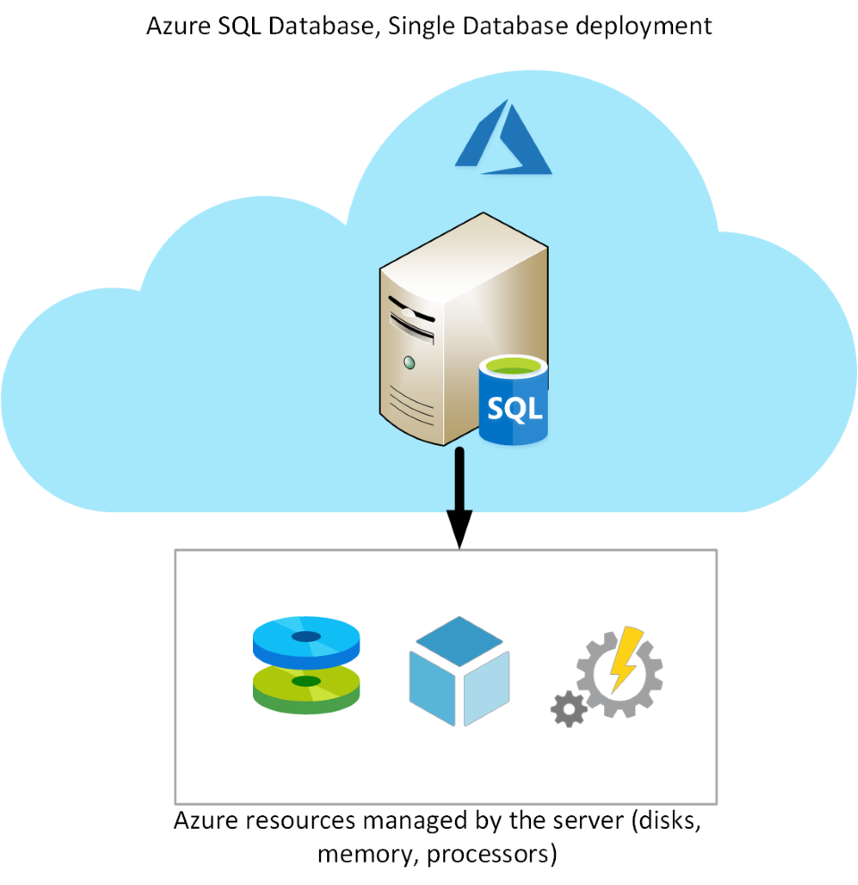
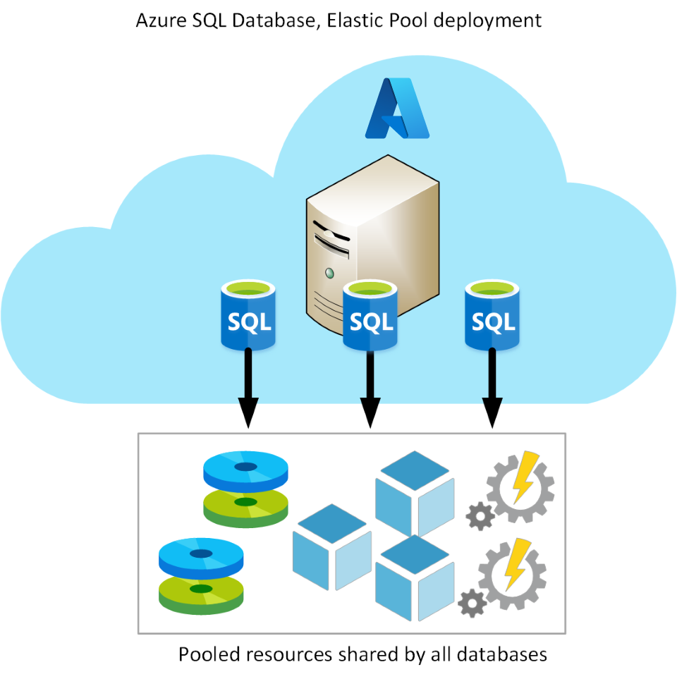

If you don't want to incur the management overhead associated with running SQL Server on a virtual machine, you can use Azure SQL Database.

## What is Azure SQL Database?

Azure SQL Database is a PaaS offering from Microsoft. You create a managed database server in the cloud, and then deploy your databases on this server. 

> [!NOTE] 
> A SQL Database server is a logical construct that acts as a central administrative point for multiple single or pooled databases, logins, firewall rules, auditing rules, threat detection policies, and failover groups.

Azure SQL Database is available with several options: *Single Database*, *Elastic Pool*, and *Managed Instance*. The following sections describe Single Database and Elastic Pool. Managed Instance is the subject of the next unit.

### Single Database

This option enables you to quickly set up and run a single SQL Server database. You create and run a database server in the cloud, and you access your database through this server. Microsoft manages the server, so all you have to do is configure the database, create your tables, and populate them with your data. You can scale the database if you need additional storage space, memory, or processing power. By default, resources are pre-allocated, and you're charged per hour for the resources you've requested. You can also specify a *serverless* configuration. In this configuration, Microsoft creates its own server, which might be shared by a number of databases belonging to other Azure subscribers. Microsoft ensures the privacy of your database. Your database automatically scales and resources are allocated or deallocated as required. For more information, read [What is a single database in Azure SQL Database](https://docs.microsoft.com/azure/sql-database/sql-database-single-database).

### Elastic Pool

This option is similar to *Single Database*, except that by default multiple databases can share the same resources, such as memory, data storage space, and processing power through multiple-tenancy. The resources are referred to as a *pool*. You create the pool, and only your databases can use the pool. This model is useful if you have databases with resource requirements that vary over time, and can help you to reduce costs. For example, your payroll database might require plenty of CPU power at the end of each month as you handle payroll processing, but at other times the database might become much less active. You might have another database that is used for running reports. This database might become active for several days in the middle of the month as management reports are generated, but with a lighter load at other times. Elastic Pool enables you to use the resources available in the pool, and then release the resources once processing has completed. 

## Use cases

Azure SQL Database gives you the best option for low cost with minimal administration. It is not fully compatible with on-premises SQL Server installations. It is often used in new cloud projects where the application design can accommodate any required changes to your applications.

> [!NOTE]
> You can use the Data Migration Assistant to detect compatibility issues with your databases that can impact database functionality in Azure SQL Database.  For more information, see [Overview of Data Migration Assistant](https://docs.microsoft.com/sql/dma/dma-overview).

Azure SQL Database is often used for:

- Modern cloud applications that need to use the latest stable SQL Server features.
- Applications that require high availability.
- Systems with a variable load, that need the database server to scale up and down quickly.

## Business benefits

Azure SQL Database automatically updates and patches the SQL Server software to ensure that you are always running the latest and most secure version of the service.

The scalability features of Azure SQL Database ensure that you can increase the resources available to store and process data without having to perform a costly manual upgrade.

The service provides high availability guarantees, to ensure that your databases are available at least 99.99% of the time. Azure SQL Database supports point-in-time restore, enabling you to recover a database to the state it was in at any point in the past. Databases can be replicated to different regions to provide additional assurance and disaster recovery

Advanced threat protection provides advanced security capabilities, such as vulnerability assessments, to help detect and remediate potential security problems with your databases. Threat protection also detects anomalous activities that indicate unusual and potentially harmful attempts to access or exploit your database. It continuously monitors your database for suspicious activities, and provides immediate security alerts on potential vulnerabilities, SQL injection attacks, and anomalous database access patterns. Threat detection alerts provide details of the suspicious activity, and recommend action on how to investigate and mitigate the threat.

Auditing tracks database events and writes them to an audit log in your Azure storage account. Auditing can help you maintain regulatory compliance, understand database activity, and gain insight into discrepancies and anomalies that might indicate business concerns or suspected security violations. 

SQL Database helps secure your data by providing encryption. For data in motion, it uses Transport Layer Security. For data at rest, it uses Transparent Data Encryption. For data in use, it uses Always Encrypted. For more information on Transport Layer Security, Transparent Data Encryption, and Always Encrypted, see the links in the Summary unit.

In the Wide World Importers scenario, linked servers are used to perform distributed queries. However, neither Single Database nor Elastic Pool support linked servers. If you want to use Single Database or Elastic Pool, you may need to modify the queries that use linked servers and rework the operations that depend on these features.