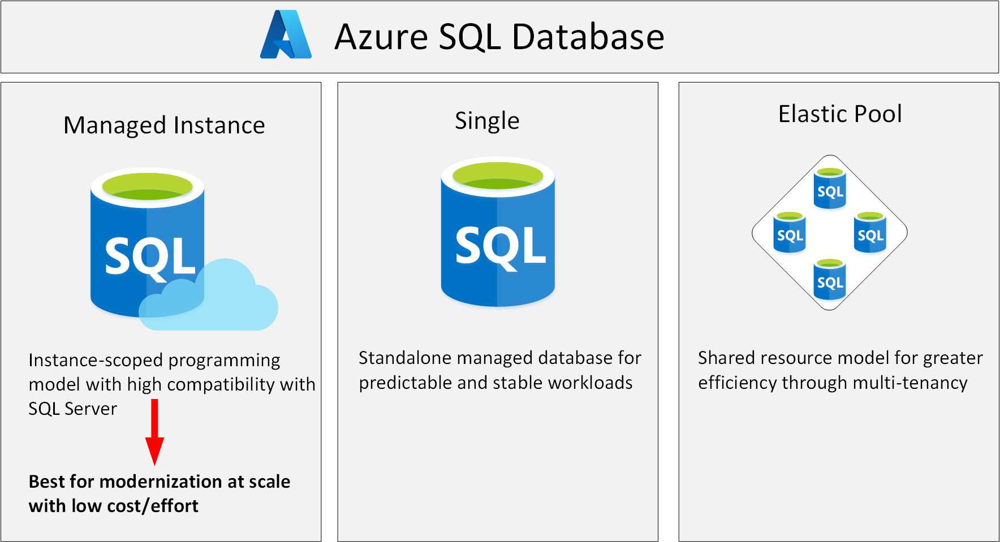

A business may want to eliminate as much management overhead as possible from administering databases and servers, but the limitations of the Single Database and Elastic Pool options may mean that those options aren't suitable. In these situations. Azure SQL Database managed instance may be a good choice to consider.

##  What is Azure SQL Database managed instance?

The Single Database and Elastic Pool options restrict some of the administrative features available to SQL Server. Managed instance effectively runs a fully controllable instance of SQL Server in the cloud. You can install multiple databases on the same instance. You have complete control over this instance, much as you would for an on-premises server. The Managed instance service automates backups, software patching, database monitoring, and other general tasks, but you have full control over security and resource allocation for your databases. You can find detailed information at [What is Azure SQL Database managed instance?](https://docs.microsoft.com/azure/sql-database/sql-database-managed-instance).

Managed instances depend on other Azure services such as Azure Storage for backups, Azure Event Hubs for telemetry, Azure Active Directory for authentication, Azure Key Vault for Transparent Data Encryption (TDE) and a couple of Azure platform services that provide security and supportability features. The managed instances make connections to these services.

All communications are encrypted and signed using certificates. To check the trustworthiness of communicating parties, managed instances constantly verify these certificates through certificate revocation lists. If the certificates are revoked, the managed instance closes the connections to protect the data.

The following image summarizes the differences between SQL Database managed instance, Single Database, and Elastic Pool

## Use cases

Consider Azure SQL Database managed instance if you want to *lift-and-shift* an on-premises SQL Server instance and all its databases to the cloud, without incurring the management overhead of running SQL Server on a virtual machine.

SQL Database managed instance provides features not available with the Single Database or Elastic Pool options. If your system uses features such as linked servers, Service Broker (a message processing system that can be used to distribute work across servers), or Database Mail (which enables your database to send email messages to users), then you should use managed instance. To check compatibility with an existing on-premises system, you can install [Data Migration Assistant (DMA)](https://www.microsoft.com/download/details.aspx?id=53595). This tool analyzes your databases on SQL Server and reports any issues that could block migration to a managed instance.

## Business benefits

SQL Database managed instance provides all the management and security benefits available when using Single Database and Elastic Pool. managed instance deployment enables a system administrator to spend less time on administrative tasks because the SQL Database service either performs them for you or greatly simplifies those tasks. Automated tasks include operating system and database management system software installation and patching, dynamic instance resizing and configuration, backups, database replication (including system databases), high availability configuration, and configuration of health and performance monitoring data streams.

Managed instance has near 100% compatibility with SQL Server Enterprise Edition, running on-premises.

The SQL Database managed instance deployment option supports traditional SQL Server Database engine logins and logins integrated with Azure Active Directory (AD). Traditional SQL Server Database engine logins include a username and a password. You must enter your credentials each time you connect to the server. Azure AD logins use the credentials associated with your current computer sign-in, and you don't need to provide them each time you connect to the server.

In the Wide World Importers scenario, SQL Database managed instance may be a more suitable choice than Single Database or Elastic Pool. SQL Database managed instance supports linked servers, although some of the other advanced features required by the database might not be available. If you want a complete match, then running SQL Server on a virtual machine may be your only option, but you need to balance the benefits of complete functionality against the administrative and maintenance overhead required. 
