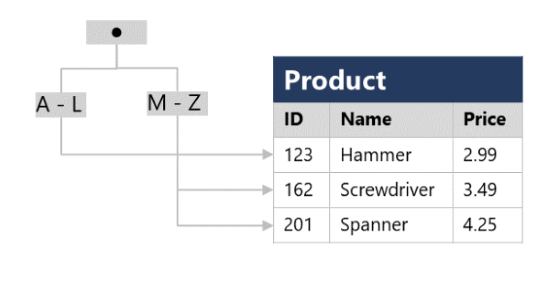

In addition to tables, a relational database can contain other structures that help to optimize data organization, encapsulate programmatic actions, and improve the speed of access. In this unit, you'll learn about three of these structures in more detail: *views*, *stored procedures*, and *indexes*.

## What is a view?

A view is a virtual table based on the results of a **SELECT** query. You can think of a view as a window on specified rows in one or more underlying tables. For example, you could create a view on the **Order** and **Customer** tables that retrieves order and customer data to provide a single object that makes it easy to determine delivery addresses for orders:

```SQL
CREATE VIEW Deliveries
AS
SELECT o.OrderNo, o.OrderDate,
       c.FirstName, c.LastName, c.Address, c.City
FROM Order AS o JOIN Customer AS c
ON o.Customer = c.ID;
```

You can query the view and filter the data in much the same way as a table. The following query finds details of orders for customers who live in Seattle:

```SQL
SELECT OrderNo, OrderDate, LastName, Address
FROM Deliveries
WHERE City = 'Seattle';
```

## What is a stored procedure?

A stored procedure defines SQL statements that can be run on command. Stored procedures are used to encapsulate programmatic logic in a database for actions that applications need to perform when working with data.

You can define a stored procedure with parameters to create a flexible solution for common actions that might need to be applied to data based on a specific key or criteria. For example, the following stored procedure could be defined to change the name of a product based on the specified product ID.

```SQL
CREATE PROCEDURE RenameProduct
	@ProductID INT,
	@NewName VARCHAR(20)
AS
UPDATE Product
SET Name = @NewName
WHERE ID = @ProductID;
```

When a product must be renamed, you can execute the stored procedure, passing the ID of the product and the new name to be assigned:

```SQL
EXEC RenameProduct 201, 'Spanner';
```

## What is an index?

An index helps you search for data in a table. Think of an index over a table like an index at the back of a book. A book index contains a sorted set of references, with the pages on which each reference occurs. When you want to find a reference to an item in the book, you look it up through the index. You can use the page numbers in the index to go directly to the correct pages in the book. Without an index, you might have to read through the entire book to find the references you're looking for.

When you create an index in a database, you specify a column from the table, and the index contains a copy of this data in a sorted order, with pointers to the corresponding rows in the table. When the user runs a query that specifies this column in the **WHERE** clause, the database management system can use this index to fetch the data more quickly than if it had to scan through the entire table row by row.

For example, you could use the following code to create an index on the **Name** column of the **Product** table:

```SQL
CREATE INDEX idx_ProductName
ON Product(Name);
```

The index creates a tree-based structure that the database system's query optimizer can use to quickly find rows in the **Product** table based on a specified **Name**.

> [!div class="mx-imgBorder"]
> 

For a table containing few rows, using the index is probably not any more efficient than simply reading the entire table and finding the rows requested by the query (in which case the query optimizer will ignore the index). However, when a table has many rows, indexes can dramatically improve the performance of queries.

You can create many indexes on a table. So, if you also wanted to find products based on price, creating another index on the **Price** column in the **Product** table might be useful. However, indexes aren't free. An index consumes storage space, and each time you insert, update, or delete data in a table, the indexes for that table must be maintained. This additional work can slow down insert, update, and delete operations. You must strike a balance between having indexes that speed up your queries versus the cost of performing other operations.
