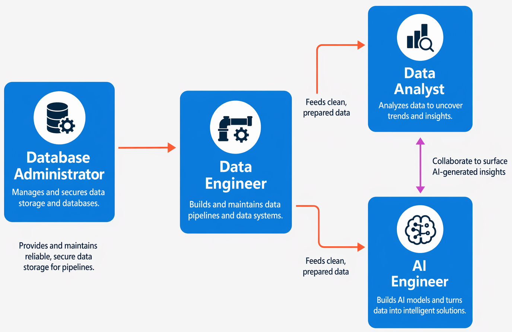

::: zone pivot="video"

>[!VIDEO https://learn-video.azurefd.net/vod/player?id=2e7390c2-04e9-4ff2-894c-35f42ac56f4f]

> [!TIP]
> See the **Text and images** tab for more details!

::: zone-end

::: zone pivot="text"

There's a wide variety of roles involved in managing, controlling, and using data. Some roles are business-oriented, some involve more engineering, some focus on research, and some are hybrid roles that combine different aspects of data management. Your organization may define roles differently, or give them different names, but the roles described in this unit encapsulate the most common division of tasks and responsibilities.

The key job roles that deal with data in most organizations are:

- **Database administrators** manage databases, assigning permissions to users, storing backup copies of data, and restoring data in the event of a failure.
- **Data engineers** manage infrastructure and processes for data integration across the organization, applying data cleaning routines, identifying data governance rules, and implementing pipelines to transfer and transform data between systems.
- **Data analysts** explore and analyze data to create visualizations and charts that enable organizations to make informed decisions.
- **AI engineers** build and integrate AI-powered features and workflows, working with large language models, machine learning pipelines, and data sources to enable intelligent scenarios.

> [!NOTE]
> The job *roles* define differentiated tasks and responsibilities. In some organizations, the same *person* might perform multiple roles; so in their role as database administrator they might provision a transactional database, and then in their role as a data engineer they might create a pipeline to transfer data from the database to a data warehouse for analysis.

## Database Administrator

A database administrator is responsible for the design, implementation, maintenance, and operational aspects of on-premises and cloud-based database systems. They're responsible for the overall availability and consistent performance and optimizations of databases. They work with stakeholders to implement policies, tools, and processes for backup and recovery plans to recover following a natural disaster or human-made error.

The database administrator is also responsible for managing the security of the data in the database, granting privileges over the data, granting or denying access to users as appropriate.

AI tools are increasingly used by database administrators to troubleshoot performance issues and draft queries using natural language, alongside the judgment and expertise the role requires.

## Data Engineer

A data engineer collaborates with stakeholders to design and implement data-related workloads, including data ingestion pipelines, cleansing and transformation activities, and data stores for analytical workloads. They use a wide range of data platform technologies, including relational and nonrelational databases, file stores, and data streams.

They're also responsible for ensuring that the privacy of data is maintained within the cloud and spanning from on-premises to the cloud data stores. They own the management and monitoring of data pipelines to ensure that data loads perform as expected.

AI tools can assist data engineers with pipeline development tasks such as generating transformation code and suggesting configurations using natural language, alongside the architectural decisions and data quality judgment the role requires.

## Data Analyst

A data analyst enables businesses to maximize the value of their data assets. They're responsible for exploring data to identify trends and relationships, designing and building analytical models, and enabling advanced analytics capabilities through reports and visualizations.

A data analyst processes raw data into relevant insights based on identified business requirements to deliver relevant insights.

AI tools can assist data analysts with tasks such as summarizing reports, suggesting visualizations, and generating analytical expressions using natural language, alongside the business understanding and communication skills the role requires.

## AI Engineer

An AI engineer builds and integrates AI-powered features into applications and data workflows. They work with large language models (LLMs)—AI systems trained on vast amounts of text that can understand and generate human language—as well as machine learning pipelines, and data sources to enable intelligent scenarios such as chat-over-your-data, content generation, and automated classification.

AI engineers collaborate closely with data engineers to access and prepare the underlying data, and with data analysts to surface AI-generated insights in reports and applications. **Microsoft Foundry** provides the tools and platform AI engineers use to build, test, and deploy these solutions.

AI assistance is central to the AI engineer's daily work—generating code, explaining model behavior, and suggesting architectures using natural language, though the design decisions, evaluation, and responsible deployment of AI systems remain distinctly human responsibilities.

> [!NOTE]
> The roles described here represent the key data-related roles found in most medium to large organizations. There are additional data-related roles not mentioned here, such as *data scientist* and *data architect*; and there are other technical professionals that work with data, including *application developers* and *software engineers*.

::: zone-end
