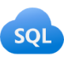
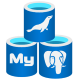

Microsoft Azure is a cloud platform that powers the applications and IT infrastructure for some of the world's largest organizations. It includes many services to support cloud solutions, including transactional and analytical data workloads.

Some of the most commonly used cloud services for data are described below.

> [!NOTE]
> This article covers only some of the most commonly used data services for modern transactional and analytical solutions. Additional services are also available.

## Azure SQL

 *Azure SQL* is the collective name for a family of relational database solutions based on the Microsoft SQL Server database engine. Specific Azure SQL services include:

- **Azure SQL Database** – a fully managed platform-as-a-service (PaaS) database hosted in Azure.
- **Azure SQL Managed Instance** – a hosted instance of SQL Server with automated maintenance, which allows more flexible configuration than Azure SQL DB but with more administrative responsibility for the owner.
- **Azure SQL VM** – a virtual machine with an installation of SQL Server, allowing maximum configurability with full management responsibility.

Database administrators typically provision and manage Azure SQL database systems to support line of business (LOB) applications that need to store transactional data.

Data engineers may use Azure SQL database systems as sources for data pipelines that perform *extract*, *transform*, and *load* (ETL) operations to ingest the transactional data into an analytical system.

Data analysts may query Azure SQL databases directly to create reports, though in large organizations the data is generally combined with data from other sources in an analytical data store to support enterprise analytics.

Azure SQL includes built-in AI assistance that helps database administrators and developers generate queries and troubleshoot performance using natural language.

## Open-source databases in Azure

 Azure includes managed services for popular open-source relational database systems, including:

- **Azure Database for MySQL** - a simple-to-use open-source database management system that is commonly used in *Linux*, *Apache*, *MySQL*, and *PHP* (LAMP) stack apps.
- **Azure Database for PostgreSQL** - a hybrid relational-object database. You can store data in relational tables, but a PostgreSQL database also enables you to store custom data types, with their own nonrelational properties.

As with Azure SQL database systems, open-source relational databases are managed by database administrators to support transactional applications, and provide a data source for data engineers building pipelines for analytical solutions and data analysts creating reports.

## Azure Cosmos DB

 Azure Cosmos DB is a global-scale nonrelational (*NoSQL*) database system that supports multiple application programming interfaces (APIs), enabling you to store and manage data as JSON documents, key-value pairs, column-families, and graphs.

In some organizations, Cosmos DB instances may be provisioned and managed by a database administrator; though often software developers manage NoSQL data storage as part of the overall application architecture. Data engineers often need to integrate Cosmos DB data sources into enterprise analytical solutions that support modeling and reporting by data analysts.

Azure Cosmos DB includes built-in AI assistance that helps developers explore and query data using natural language, accelerating development of AI-powered applications.

## Azure Storage

 Azure Storage is a core Azure service that enables you to store data in:
 - **Blob containers** - scalable, cost-effective storage for binary files.
 - **File shares** - network file shares such as you typically find in corporate networks.
 - **Tables** - key-value storage for applications that need to read and write data values quickly.

 Data engineers use Azure Storage to host *data lakes* - blob storage with a hierarchical namespace that enables files to be organized in folders in a distributed file system.

## Azure Data Factory

 Azure Data Factory is an Azure service that enables you to define and schedule data pipelines to transfer and transform data. You can integrate your pipelines with other Azure services, enabling you to ingest data from cloud data stores, process the data using cloud-based compute, and persist the results in another data store.

Azure Data Factory is used by data engineers to build *extract*, *transform*, and *load* (ETL) solutions that populate analytical data stores with data from transactional systems across the organization. A version of Data Factory is also built into **Microsoft Fabric** as **Fabric Data Factory—the recommended choice for integrated analytics pipelines when all your data work is within the Fabric platform.

## Microsoft Fabric
 Microsoft Fabric is Microsoft's unified software-as-a-service (SaaS) analytics platform. It brings data engineering, data warehousing, real-time analytics, data science, and Power BI together in a single browser-based workspace on top of one shared storage layer called **OneLake**. You don't manage servers or clusters—you create workspaces and items, and Microsoft runs the infrastructure.

Within Microsoft Fabric, data professionals work with integrated capabilities including:

- Data ingestion and ETL with **Fabric Data Factory**
- Data lakehouse analytics with **Fabric Lakehouse**
- Data warehouse analytics with **Fabric Warehouse**
- Data science and machine learning
- Real-Time Intelligence for streaming data
- Data visualization with **Power BI**
- Databases (SQL database and Cosmos DB in Fabric)
- Data governance and management

Data engineers can use Microsoft Fabric to create a unified data analytics solution that combines data ingestion pipelines, data warehouses, real-time analytics, business intelligence, and AI-powered insights—all centrally stored in OneLake.

Microsoft Fabric includes built-in AI assistance that helps data professionals build pipelines, write SQL, generate notebook code, and explore data using natural language.

## Microsoft Fabric IQ

 Fabric IQ is a workload in Microsoft Fabric that unifies data across OneLake and contextualizes it according to the language of your business. It exposes that data to analytics, AI agents, and applications with consistent semantic meaning—so every tool and every team shares the same definitions for business concepts like *Customer*, *Order*, or *Product*.

Fabric IQ includes several items that work together:

- **Ontology** defines your enterprise vocabulary—entity types, relationships, properties, and business rules—and maps them to real data in OneLake without copying or moving it.
- **Data agents** allow users to ask questions about business data in natural language, grounded in the shared ontology.
- **Operations agents** monitor real-time data streams and trigger automated actions when business rules are met.
- **Graph** provides a visual, connected representation of business concepts and their relationships, enabling dependency analysis and multi-hop reasoning.
- **Plan** supports collaborative planning, reporting, and analytics on a unified data foundation.

> [!NOTE]
> Fabric IQ is currently in preview.

## Power BI

Power BI is Microsoft's business intelligence and data visualization platform. Data analysts use Power BI to connect to data sources, build interactive reports and dashboards, and share insights across their organization.

Power BI is available as a standalone service and is also built into Microsoft Fabric, where it works alongside data engineering and warehouse capabilities in the same workspace. In Fabric, Power BI connects to data through **semantic models—structured analytical layers that define measures, relationships, and business logic.

Power BI includes built-in AI assistance that helps data analysts summarize reports, suggest visualizations, generate DAX measures, and create written narratives from data using natural language.

## Azure Databricks

 Azure Databricks is a cloud analytics platform built on Apache Spark. It's optimized for large-scale data engineering, data science, and SQL analytics over open lakehouse formats—primarily **Delta Lake**. It runs as a managed service inside your Azure subscription and is a common choice for teams that need code-first Spark and notebook-based workflows.

Data engineers can use existing Databricks and Spark skills to create analytical data stores in Azure Databricks.

Data analysts can use the native notebook support in Azure Databricks to query and visualize data in an easy-to-use web-based interface.

Azure Databricks includes built-in AI assistance that helps data engineers and analysts write Spark code, generate SQL queries, and explain complex notebook logic using natural language.

## Azure Stream Analytics

 Azure Stream Analytics is a real-time stream processing engine that captures a stream of data from an input, applies a query to extract and manipulate data from the input stream, and writes the results to an output for analysis or further processing.

Data engineers can incorporate Azure Stream Analytics into data analytics architectures that capture streaming data for ingestion into an analytical data store or for real-time visualization.

## Azure Data Explorer

 Azure Data Explorer is a fully managed, standalone, big data analytics platform that offers high-performance querying of log and telemetry data.

Data analysts can use Azure Data Explorer to query and analyze data that includes a timestamp attribute, such as is typically found in log files and *Internet-of-things* (IoT) telemetry data.

## Microsoft Purview

 Microsoft Purview provides a solution for enterprise-wide data governance and discoverability. You can use Microsoft Purview to create a map of your data and track data lineage across multiple data sources and systems, enabling you to find trustworthy data for analysis and reporting.

Data engineers can use Microsoft Purview to enforce data governance across the enterprise and ensure the integrity of data used to support analytical workloads.

## Microsoft Foundry

 Microsoft Foundry is Microsoft's unified Azure platform-as-a-service (PaaS) for enterprise AI operations, model builders, and application development. It provides the tools, model access, and infrastructure that AI engineers—and developers more broadly—use to design, test, and deploy intelligent solutions, including chat-over-your-data applications, multi-agent workflows, and automated AI pipelines integrated with Azure data services.