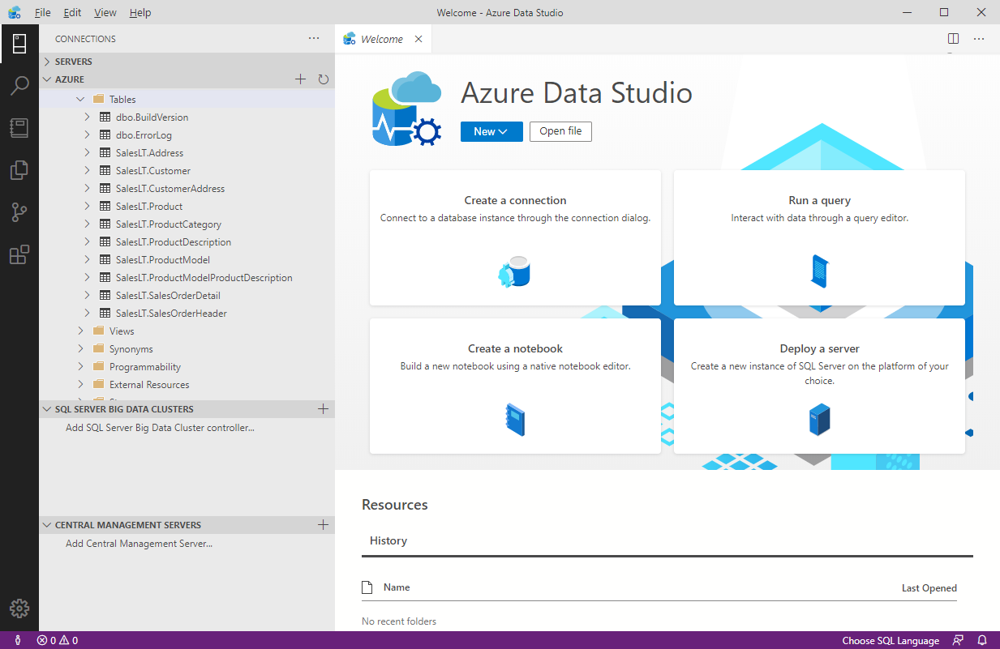
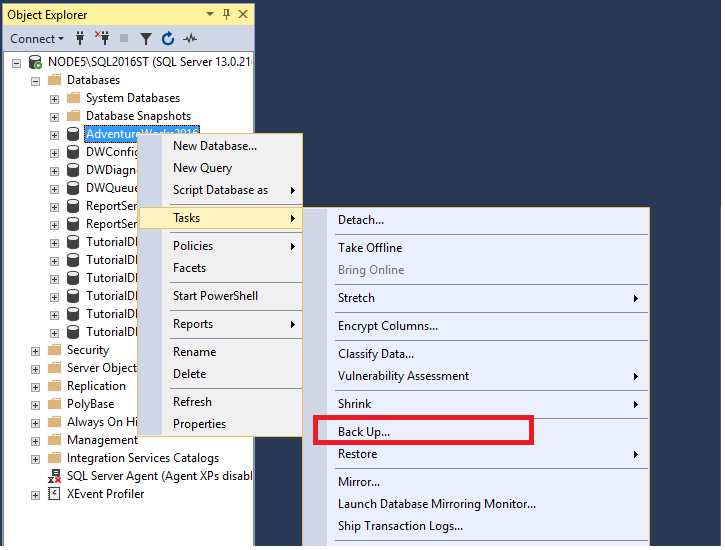
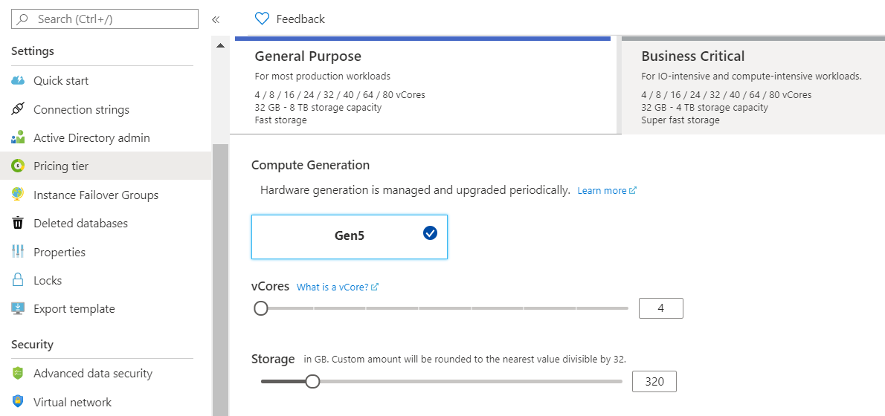

Database Administrators are tasked with managing and organizing databases. A database administrator's primary job is to ensure that data is available, protected from loss, corruption, or theft, and is easily accessible as needed.

## Database Administrator tasks and responsibilities

Some of the most common roles and responsibilities of a database administrator include:

- Installing and upgrading the database server and application tools.
- Allocating system storage and planning storage requirements for the database system.
- Modifying the database structure, as necessary, from information given by application developers.
- Enrolling users and maintaining system security.
- Ensuring compliance with database vendor license agreement.
- Controlling and monitoring user access to the database.
- Monitoring and optimizing the performance of the database.
- Planning for backup and recovery of database information.
- Maintaining archived data.
- Backing up and restoring databases.
- Contacting database vendor for technical support.
- Generating various reports by querying from database as per need.
- Managing and monitoring data replication.

## Common database administrator tools

Most database management systems provide their own set of tools to assist with database administration. For example, SQL Server Database Administrators use *SQL Server Management Studio* for most of their day-to-day database maintenance activities. Other systems have their own database-specific interfaces, such as *pgAdmin* for PostgreSQL systems, or *MySQL Workbench* for MySQL. There are also a number of cross-platform database administration tools available. One example is Azure Data Studio.

### What is Azure Data Studio?

Azure Data Studio provides a graphical user interface for managing many different database systems. It currently provides connections to on-premises SQL Server databases, Azure SQL Database, PostgreSQL, Azure SQL Data Warehouse, and SQL Server Big Data Clusters, amongst others. It's an extensible tool, and you can download and install extensions from third-party developers that connect to other systems, or provide wizards that help to automate many administrative tasks.

> [!div class="mx-imgBorder"]
> 

### What is SQL Server Management Studio?

SQL Server Management Studio provides a graphical interface, enabling you to query data, perform general database administration tasks, and generate scripts for automating database maintenance and support operations. The example below shows SQL Server Management Studio being used to back up a database.

> [!div class="mx-imgBorder"]
> 

A useful feature of SQL Server Management Studio is the ability to generate Transact-SQL scripts for almost all of the functionality that SSMS provides. This gives the DBA the ability to schedule and automate many common tasks.

> [!div class="mx-imgBorder"]
> 

> [!NOTE]
> Transact-SQL is a set of programming extensions from Microsoft that adds several features to the Structured Query Language (SQL), including transaction control, exception and error handling, row processing, and declared variables.

### Use the Azure portal to manage Azure SQL Database

Azure SQL database provides database services in Azure. It's similar to SQL Server, except that it runs in the cloud. You can manage Azure SQL database using [Azure portal](https://portal.azure.com/#home).

Typical configuration tasks such as increasing the database size, creating a new database, and deleting an existing database are done using the Azure portal.

> [!div class="mx-imgBorder"]
> 

You can use the Azure portal to dynamically manage and adjust resources such as the data storage size and the number of cores available for the database processing. These tasks would require the support of a system administrator if you were running the database on-premises.