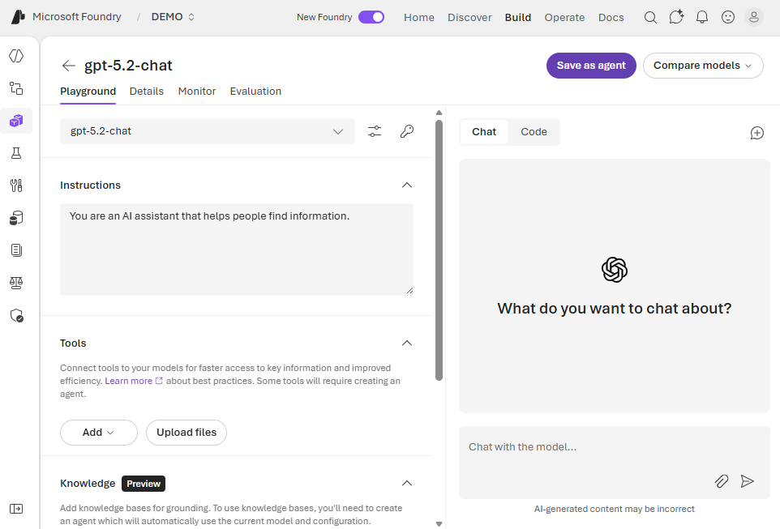

Before you write code with the Microsoft Foundry SDK, it's helpful to explore what your project can do through the Foundry portal. The portal provides interactive tools for testing models and generating code samples that you can use as starting points for your applications.

## Exploring with the Chat playground

The **Chat playground** in the Foundry portal provides an interactive environment for testing models before you write any code. You can access it by selecting **Chat playground** from the left navigation.

The playground lets you:
- Send prompts to deployed models and see responses in real time
- Adjust settings like temperature and max tokens
- Add system messages to customize model behavior
- Experiment with different models and configurations

This no-code environment helps you understand how models respond to different inputs and settings, making it easier to design your application.

## Generating code samples

One of the most useful features of the Chat playground is the **Code** button in the chat pane. At any point during your experimentation, you can select this button to see code samples to reproduce a chat session in your app.

The generated code samples include choices for:
- **API** - Using Responses API, or another API like Completions
- **Language** - Select your preferred programming language
- **SDK** - Choose which SDK you want to see a sample of

These samples are pre-populated with your project endpoint, model deployment name, and current settings. They provide a ready-to-use starting point for building your application.

You can copy this code directly into your development environment and modify it to fit your needs.

## From playground to code

The typical workflow for building an AI application with Microsoft Foundry looks like this:

1. **Explore in the playground** - Test prompts, adjust settings, and find what works
2. **Generate code samples** - Use the **Code** tab to get SDK samples 
3. **Develop your application** - Take the generated code and customize it for your specific needs
4. **Iterate and refine** - Return to the playground to test new ideas, then update your code

This approach lets you quickly prototype and validate your ideas before investing time in development.

In the next unit, you'll learn about the Microsoft Foundry SDK and how to use it to programmatically work with your projects.
