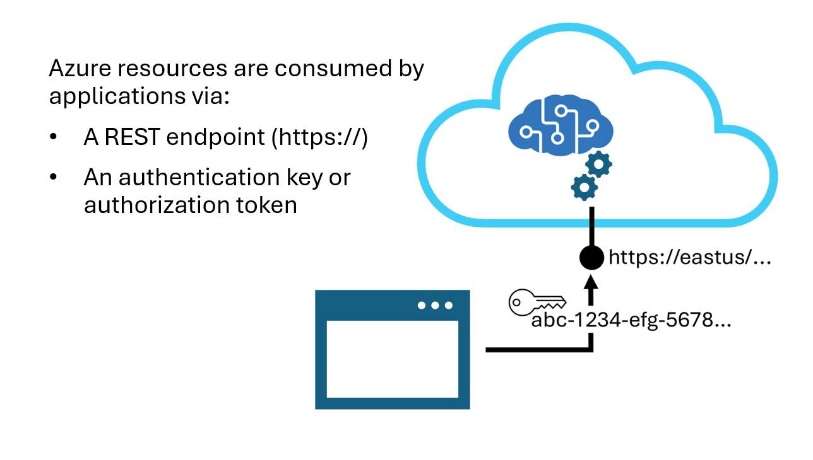

Azure AI services are AI capabilities that can be built into web or mobile applications, in a way that's straightforward to implement. These AI services include image recognition, natural language processing, speech, AI-powered search, and more. There are over a dozen [different services](/azure/ai-services/what-are-ai-services#available-azure-ai-services?azure-portal=true) that can be used separately or together to add AI power to applications.

Let's take a look at some examples of what can be done with Azure AI services. The Azure AI Content Safety service can be used to detect harmful content within text or images, including violent or hateful content, and report on its severity. The Azure AI Language service can be used to summarize text, classify information, or extract key phrases. The Azure AI Speech service provides powerful speech to text and text to speech capabilities, allowing speech to be accurately transcribed into text, or text to natural sounding voice audio. 

Azure AI services are based on three principles that dramatically improve speed-to-market:
- Prebuilt and ready to use
- Accessed through APIs
- Available on Azure

## Azure AI services are prebuilt and ready to use

AI has been prohibitive for all but the largest technology companies because of several factors, including the large amounts of data required to train models, the massive amount of computing power needed, and the budget to hire specialist programmers. Azure AI services make AI accessible to businesses of all sizes by using pre-trained machine learning models to deliver AI as a service. Azure AI services use high-performance Azure computing to deploy advanced AI models as resources, making decades of research available to developers of all skill levels.

Azure AI services are a portfolio of services, with capabilities suitable for use cases across sectors and industries. 

For example, in education, Immersive Reader is being used to support students by adapting to their requirements. Learners can have varying needs, such as wanting to read more slowly, get words or text translated into another language, or see pictures to aid their understanding. Immersive Reader helps students with different needs learn at their own pace, and in their own way.

While Azure AI services can be used without any modification, some AI services can be customized to better fit specific requirements. Customization capabilities in Azure AI Vision, Azure AI Speech, and Azure OpenAI all allow you to add data to existing models. 

For example, in sport, athletes, and coaches are customizing Azure AI Vision to improve performance and reduce injury. One application allows [surfers](https://unlocked.microsoft.com/usa-surf?azure-portal=true) to upload a video and receive AI-generated insights and analysis. These insights can then be used by coaches, medics, judges, and event broadcasters.

## Azure AI services are accessed through APIs

Azure AI services are designed to be used in different development environments, with minimal coding. Developers can access AI services through REST APIs, client libraries, or integrate them with tools such as Logic Apps and Power Automate. APIs are application programming interfaces that define the information that is required for one component to use the services of the other. APIs enable software components to communicate, so one side can be updated without stopping the other from working. Find out more about development options for Azure AI services [here](/azure/ai-services/what-are-ai-services#use-azure-ai-services-in-different-development-environments?azure-portal=true).

## Azure AI services are available on Azure

AI services are cloud-based and accessed through Azure resource. This means that they're managed in the same way as other Azure services, such as platform as a service (PaaS), infrastructure as a service (IaaS), or a managed database service. The Azure platform and Resource Manager provide a consistent framework for all your Azure services, from creating or deleting resources, to availability and billing. 

> [!NOTE]
> In some situations, AI has the potential to be used in ways that might compromise an individual's privacy or rights. Microsoft has [six Responsible AI principles](/azure/cloud-adoption-framework/innovate/best-practices/trusted-ai?azure-portal=true) to help ensure AI services are ethical and fair. Because of this, certain Azure AI services are restricted to ensure they're used responsibly.

