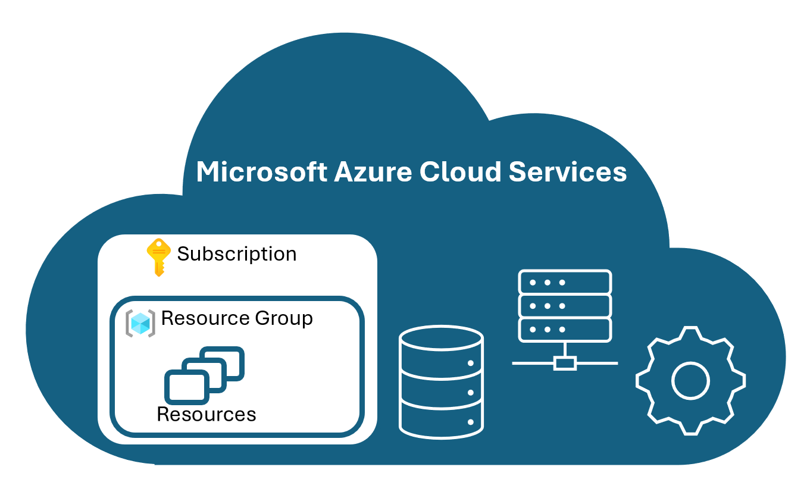
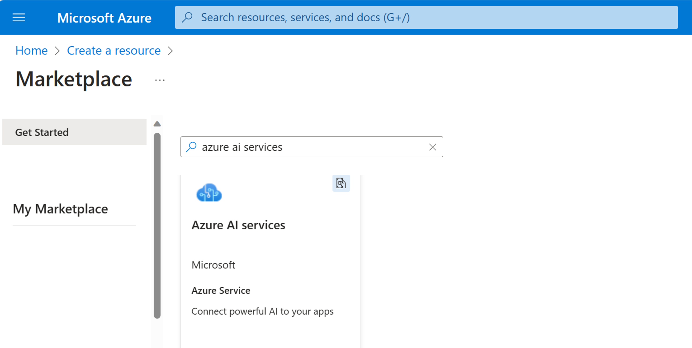

Azure AI services are cloud-based, and like all Azure services you need to create a resource to use them. There are two types of AI service resources: multi-service or single-service. Your development requirements and how you want costs to be billed determine the types of resources you need. 

- **Multi-service resource**: a resource created in the Azure portal that provides access to multiple Azure AI services with a single key and endpoint. Use the resource **Azure AI services** when you need several AI services or are exploring AI capabilities. When you use an Azure AI services resource, all your AI services are billed together.
- **Single-service resources**: a resource created in the Azure portal that provides access to a single Azure AI service, such as Speech, Vision, Language, etc. Each Azure AI service has a unique key and endpoint. These resources might be used when you only require one AI service or want to see cost information separately. 

You can create a resource [several ways](/azure/developer/intro/azure-developer-create-resources?azure-portal=true), such as in the [Azure portal](https://portal.azure.com?azure-portal=true).  

## How to use the Azure portal to create an Azure AI services resource 

To create an Azure AI services resource, sign in to the [Azure portal](https://portal.azure.com?azure-portal=true) with Contributor access and select **Create a resource**. To create a multi-services resource search for *Azure AI services* in the marketplace. 

To create a single-service resource, search for the specific Azure AI service such as Face, Language, or Content Safety, and so on. Most AI services have a free price tier to allow you to explore their capabilities. After clicking **Create** for the resource you require, you will be prompted to complete details of your subscription, the resource group to contain the resource, the region, a unique name, and the price tier. 