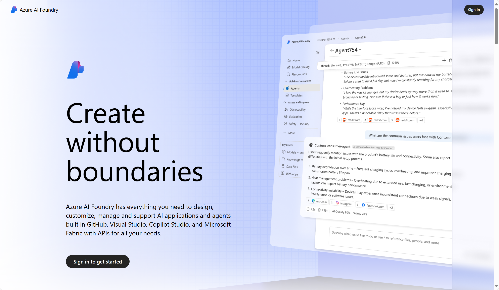
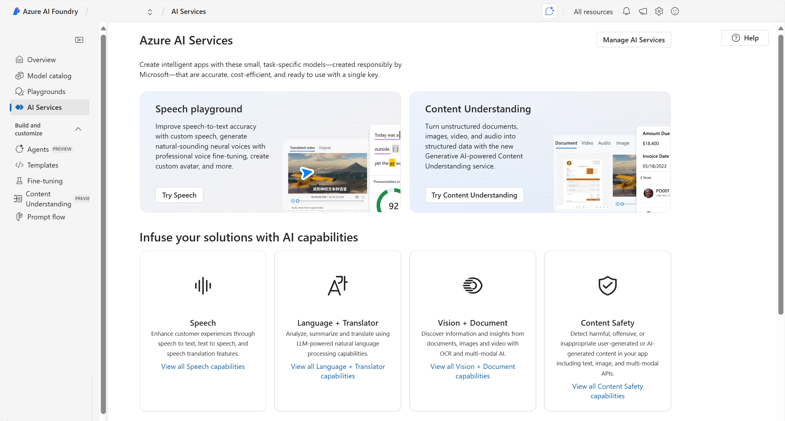

Once you create an Azure AI service resource, you can build applications using the REST API, software development kits (SDKs), or visual studio interfaces.

> [!NOTE]
> When developers incorporate an AI service into their applications, they often use a [SDK](/training/modules/create-manage-cognitive-services/5-use-sdk?azure-portal=true) or the [REST API](/training/modules/create-manage-cognitive-services/4-use-rest?azure-portal=true).

## Using Azure AI Foundry portal

[**Azure AI Foundry portal**](https://ai.azure.com/) is a unified platform and visual interface for enterprise AI operations, model builders, and application development. Azure AI Foundry portal combines access to multiple Azure AI services and generative AI models into one user interface. 

