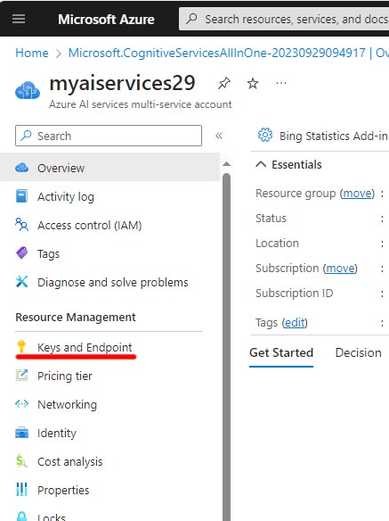

You've now learned how to create an AI service resource and associate it with an Azure AI studio. But how do you ensure that only those authorized have access to your AI service? This is done through authentication, the process of verifying that the user or service is who they say they are, and that they are authorized to use the service. 

Most Azure AI services are accessed through a RESTful API, although there are other ways. The API defines what information is passed between two software components: the Azure AI service and whatever is using it. Having a clearly defined interface is important, because if the AI service is updated, your application must continue to work correctly.

Part of what an API does is to handle authentication. Whenever a request is made to use an AI services resource, that request must be authenticated. For example, your subscription and AI service resource is verified to ensure you have sufficient permissions to access it. This authentication process uses an endpoint and a resource key. 

The endpoint describes how to reach the AI service resource instance that you want to use, in a similar way to the way a URL identifies a web site. When you view the endpoint for your resource, it will look something like: 
```
https://myaiservices29.cognitiveservices.azure.com/
```

The resource key protects the privacy of your resource. To ensure this is always secure, the key can be changed periodically. You can view the endpoint and key in the Azure portal under Resource Management and Keys and Endpoint.



When you write code to access the AI service, the keys and endpoint must be included in the authentication header. The authentication header sends an authorization key to the service to confirm that the application can use the resource. Learn more about different [authentication requests to Azure AI services here](/azure/ai-services/authentication?azure-portal=true).

When you use a studio interface with Azure AI services, your credentials are authenticated when you sign in, and a similar process is happening in the background. 

