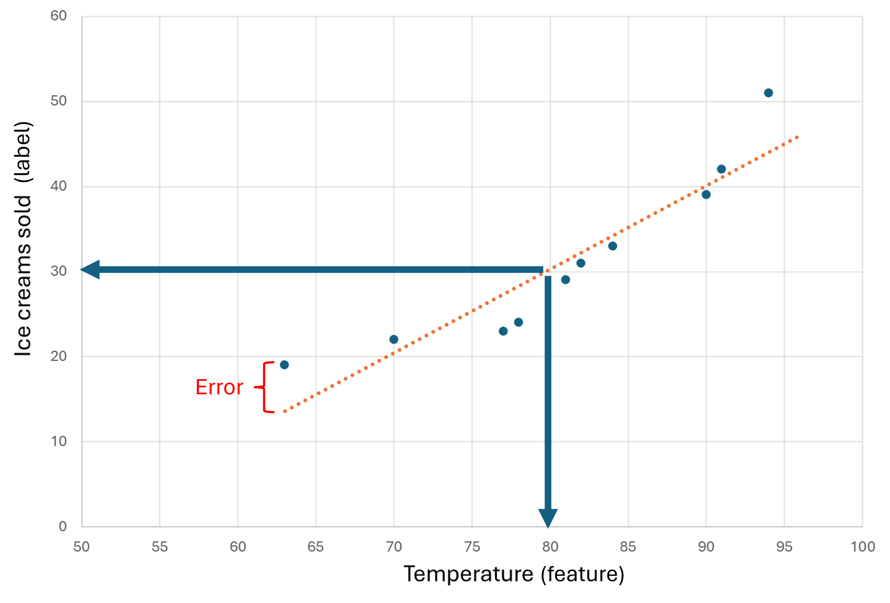

**Artificial Intelligence** imitates human behavior by relying on machines to learn and execute tasks without explicit directions on what to output. Since the mid-20th century, researchers, often known as *data scientists*, have worked on different approaches to AI, broadly through **Machine learning**, a branch of AI that combines computer science and mathematics. Most modern applications of artificial intelligence in general have their origins in machine learning.  

Machine learning models try to capture the relationship between data with equations. These equations are created by taking in data (like temperature) and fitting a model to the data to make predictions (like how how many units of ice cream a store may sell that day). Temperature is a *feature*, a factor that influence the result. The result is the number of units sold in the day and is known as the *label*. 

The relationship between the temperature and units of ice cream can be visualized in a graph. On the graph, the points on the graph describe what the average temperature was on a day when a certain number of ice cream units were sold. The red line can be thought of as a simple model captures this relationship. The model allows you to predict how many ice cream units can be sold based any temperature.  

 

How well a model solves a problem can be quantified in what is known as evaluation metrics. One evaluation metric is error, which we can think of the distance between an actual label and a predicted label. In the case of the store, the model may predict 10 items will be sold in a day. If at the end of the day the store sells 15 items, the actual label is 15. We can try to improve models by reducing the overall error.    

## Language modeling

These approaches to AI have advanced to complete tasks of greater complexity. **Deep learning** developed as a subset of machine learning to address complex tasks using layers of algorithms. In the beginning of the 2000's, deep learning algorithms were used to solve for language learning problems. These approaches are categorized as **Natural language processing** (NLP) methods, which enable machines to process and understand the context of language.

Today, using a mix of machine learning and deep learning capabilities, scientists have developed approaches for machines to understand the context of a document, and to create new content with **generative AI**. 

Consumers typically use generative AI by interacting with the visual screen of an application, or front-end user interface, that is often in the form of a chat window. Behind the scenes on the back-end, language models works to produce responses that appear on the screen.  

## Generative AI capabilities

Generative AI applications take in natural language input, known as **prompts**, and return a response.  

Some examples of prompts include: 

|Common task | Sample prompt | Type of response |
|-|-|-|
|Generate and understand natural language text | "Give me three ideas for a healthy breakfast including peppers" | `Natural language` | 
|Generate and understand images | "Create an image of an elephant eating a burger" | `An image` |
|Generate and understand code | "Show me how to code a game of tic-tac-toe with Python" | `Code` |  

We get responses that appear like the model understands our prompts because of language modeling. Understanding how generative AI's language modeling works can give you a greater ability to apply its capabilities with greater confidence. Next we will take a look at how large language models work to create original content based on natural language input.
