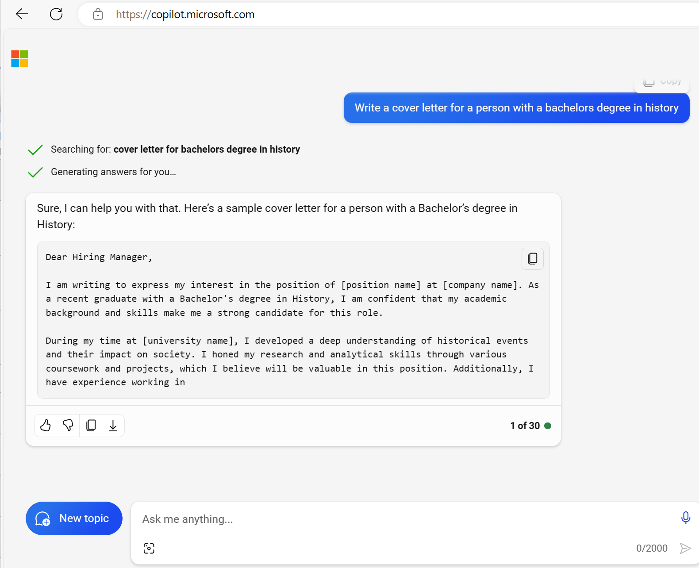

Artificial Intelligence (AI) imitates human behavior by using machine learning to interact with the environment and execute tasks without explicit directions on what to output.

*Generative* AI describes a category of capabilities within AI that create original content. People typically interact with generative AI that has been built into chat applications. One popular example of such an application is [Microsoft Copilot](https://copilot.microsoft.com), a chatbot companion to browse the web more effectively.

Generative AI applications take in natural language input, and return appropriate responses in a variety of formats such as natural language, images, or code. 

## Natural language generation

To generate a natural language response, you might submit a request such as *"Write a cover letter for a person with a bachelor's degree in history."*

A generative AI application might respond to such a request like this:

*Dear Hiring Manager,
I am writing to express my interest in the position of...*



## Image generation

Some generative AI applications can interpret a natural language request and generate an appropriate image. For example, you might submit a request like *"Create a logo for a florist business."*

A generative AI application could then return an original new image based on the description you provided, like this:


## Code generation

Some generative AI applications are designed to help software developers write code. For example, you could submit a request like *"Write Python code to add two numbers."* and generate the following response:

```python
def add_numbers(a, b):
    return a + b

```