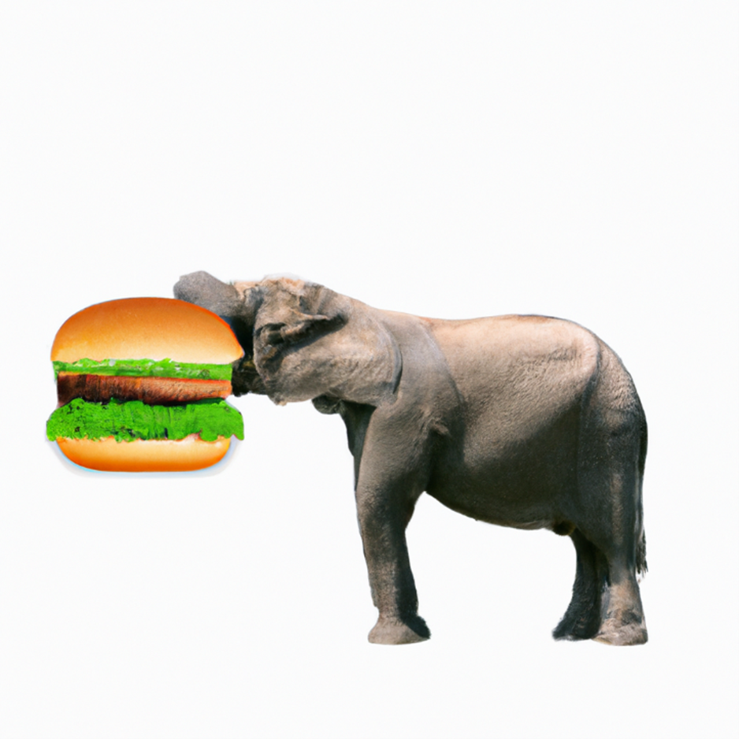

Artificial Intelligence (AI) imitates human behavior by using machine learning to interact with the environment and execute tasks without explicit directions on what to output.

*Generative* AI describes a category of capabilities within AI that create original content. People typically interact with generative AI that has been built into chat applications. One popular example of such an application is [ChatGPT](https://openai.com/chatgpt), a chatbot created by OpenAI, an AI research company that partners closely with Microsoft.

Generative AI applications take in natural language input, and return appropriate responses in a variety of formats such as natural language, images, or code. 

## Natural language generation

To generate a natural language response, you might submit a request such as *"Give me three ideas for a healthy breakfast including peppers."*

A generative AI application might respond to such a request like this:

*OK, here are three healthy breakfasts that include peppers:*

*1. Egg and Pepper Scramble: Dice up some bell peppers and sauté them in a pan until they're slightly softened. Then, add in some beaten eggs and scramble everything together. Serve with whole-grain toast for a nutritious breakfast.*

*2. Pepper and Avocado Toast: Toast a slice of whole-grain bread and top it with sliced bell peppers, mashed avocado, and a sprinkle of salt and pepper. This is a great way to get some healthy fats from the avocado along with the vitamin C from the peppers.*
  
*3. Breakfast Burrito with Peppers: Sauté some diced bell peppers, onions, and scrambled eggs together in a pan. Then, spoon the mixture onto a whole-grain tortilla and top with some salsa or hot sauce. Roll it up and enjoy a satisfying and nutritious breakfast.*

## Image generation

Some generative AI applications can interpret a natural language request and generate an appropriate image. For example, you might submit a request like *"Create an image of an elephant eating a burger"*.

A generative AI application could then return an original new image based on the description you provided, like this:



## Code generation

Some generative AI applications are designed to help software developers write code. For example, you could submit a request like *"Show me how to code a game of tic-tac-toe with Python"* and generate the following response:

*Sure, here's some basic code for a Tic-Tac-Toe game in Python:*

```
board = [' ' for x in range(9)]  
  
def print_board():  
    row1 = '| {} | {} | {} |'.format(board[0], board[1], board[2])  
    row2 = '| {} | {} | {} |'.format(board[3], board[4], board[5])  
    row3 = '| {} | {} | {} |'.format(board[6], board[7], board[8])  
    print()  
    print(row1)  
    print(row2)  
    print(row3)  
    print()  
  
def player_move(icon):  
    if icon == 'X':  
        number = 1  
    elif icon == 'O':  
        number = 2  
    print('Your turn player {}'.format(number))  
    choice = int(input('Enter your move (1-9): ').strip())  
    if board[choice - 1] == ' ':  
        board[choice - 1] = icon  
    else:  
        print()  
        print('That space is taken!')  
  
def is_victory(icon):  
    if (board[0] == icon and board[1] == icon and board[2] == icon) or \  
       (board[3] == icon and board[4] == icon and board[5] == icon) or \  
       (board[6] == icon and board[7] == icon and board[8] == icon) or \  
       (board[0] == icon and board[3] == icon and board[6] == icon) or \  
       (board[1] == icon and board[4] == icon and board[7] == icon) or \  
       (board[2] == icon and board[5] == icon and board[8] == icon) or \  
       (board[0] == icon and board[4] == icon and board[8] == icon) or \  
       (board[2] == icon and board[4] == icon and board[6] == icon):  
        return True  
    else:  
        return False  
  
def is_draw():  
    if ' ' not in board:  
        return True  
    else:  
        return False  
  
while True:  
    print_board()  
    player_move('X')  
    print_board()  
    if is_victory('X'):  
        print('X Wins! Congratulations!')  
        break  
    elif is_draw():  
        print('The game is a draw!')  
        break  
    player_move('O')  
    if is_victory('O'):  
        print_board()  
        print('O Wins! Congratulations!')  
        break  
    elif is_draw():  
        print('The game is a draw!')  
        break  
 ```

*This is just a basic implementation of the game, and can be improved upon with additional features such as error handling and input validation.*


