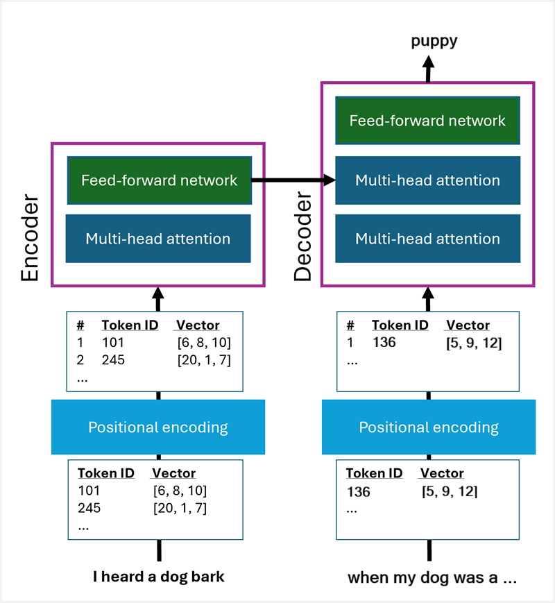

::: zone pivot="video"

>[!VIDEO https://learn-video.azurefd.net/vod/player?id=fdb3cc8e-1efb-4d2e-8c63-06048ecdbdfb]

> [!NOTE]
> See the **Text and images** tab for more details!

::: zone-end

::: zone pivot="text"

At the core of generative AI, large language models (LLMs) - and their more compact relations, small language models (SLMs) - encapsulate the linguistic and semantic relationships between the words and phrases in a vocabulary. The model can use these relationships to reason over natural language input and generate meaningful and relevant responses.

Fundamentally, LLMs are trained to generate *completions* based on *prompts*. Think of them as being super-powerful examples of the predictive text feature on many cellphones. A prompt starts a sequence of text predictions that results in a semantically correct completion. The trick is that the model understands the relationships between words and it can identify which words in the sequence so far are most likely to influence the next one; and use that to predict the most probable continuation of the sequence.

For example, consider the following sentence:

> *I heard a dog bark loudly at a cat*

Now, suppose you only heard the first few words: *"I heard a dog ..."*. You know that some of these words are more helpful clues as to what the next word might be than others. You know that "heard" and "dog" are strong indicators of what comes next, and that helps you narrow down the probabilities. You know that there's a good chance the sentence will continue as *"I <u>heard</u> a <u>dog</u> **bark**"*.

You're able to guess the next word because:

- You have a large vocabulary of words to draw from.
- You've learned common linguistic structures, so you know how words relate to one another in meaningful sentences.
- You have an understanding of semantic concepts associated with words - you know that something you *heard* must be a sound of some kind, and you know that there are specific sounds that are made by a *dog*.

So how do we train a model to have these same abilities?

## Tokenization

The first step is to provide the model with a large vocabulary of words and phrases; and we do mean *large*. The latest generation of LLMs have vocabularies that consist of hundreds of thousands of tokens, based on large volumes of training data from across the Internet and other sources.

Wait a minute. *Tokens*?

While we tend to think of language in terms of *words*, LLMs break down their vocabulary into *tokens*. Tokens include words, but also *sub*-words (like the "un" in "unbelievable" and "unlikely"), punctuation, and other commonly used sequences of characters. The first step in training a large language model therefore is to break down the training text into its distinct tokens, and assign a unique integer identifier to each one, like this:

- I (1)
- heard (2)
- a (3)
- dog (4)
- bark (5)
- loudly (6)
- at (7)
- a (3) *already assigned*
- cat (8)

and so on.

As you add more training data, more tokens will be added to the vocabulary and assigned identifiers; so you might end up with tokens for words like *puppy*, *skateboard*, *car*, and others.

> [!NOTE]
>  In this simple example, we've tokenized the example text based on *words*. In reality there would also be sub-words, punctuation, and other tokens.

## Transforming tokens with a *transformer*

Now that we have a set of tokens with unique IDs, we need to find a way to relate them to one another. To do this, we assign each token a *vector* (an array of multiple numeric values, like [1, 23, 45]). Each vector has multiple numeric *elements* or *dimensions*, and we can use these to encode linguistic and semantic attributes of the token to help provide a great deal of information about what the token *means* and how it relates to other tokens, in an efficient format.

We need to transform the initial vector representations of the tokens into new vectors with linguistic and semantic characteristics embedded in them, based on the contexts in which they appear in the training data. Because the new vectors have semantic values embedded in them, we call them *embeddings*.

To accomplish this task, we use a *transformer* model. This kind of model consists of two "blocks":

- An *encoder* block that creates the embeddings by applying a technique called *attention*. The attention layer examines each token in turn, and determines how it's influenced by the tokens around it. To make the encoding process more efficient, *multi-head* attention is used to evaluate multiple elements of the token in parallel and assign weights that can be used to calculate the new vector element values. The results of the attention layer are fed into a fully connected neural network to find the best vector representation of the embedding.
- A *decoder* layer that uses the embeddings calculated by the encoder to determine the next most probable token in a sequence started by a prompt. The decoder also uses attention and a feed-forward neural network to make its predictions.

> [!NOTE]
> We've greatly simplified the transformer architecture and process in the description and diagram. Don't worry too much about the specific details of how attention works - the key point is that it helps capture linguistic and semantic characteristics of each token based on the contexts in which it's used. If you want a deeper dive into the transformer architecture and how it uses attention, you can read the original *[Attention is all you need](https://arxiv.org/abs/1706.03762&azure-portal=true)* paper.

### Initial vectors and positional encoding

Initially, the token vector values are assigned randomly, before being fed through the transformer to create embedding vectors. The token vectors are fed into the transformer along with a *positional encoding* that indicates where the token appears in the sequence of training text (we need to do this because the order in which tokens appear in the sequence is relevant to how they relate to one another). For example, our tokens might start off looking like this:

|Token | Token ID | Position | Vector |
|--|--|--|--|
| I | 1 | 1 | [3, 7, 10] |
| heard | 2 | 2 | [2, 15, 1] |
| a | 3 | 3 | [9, 11, 1] |
| dog | 4 | 4 |[2, 7, 11] |
| bark | 5 | 5 | [9, 12, 0] |
| loudly | 6 | 6 | [3, 8, 13] |
| at | 7 | 7 | [5, 7, 10] |
| a | 3 | 8 | [9, 11, 1] |
| cat | 8 | 9 | [8, -6, 9 ] |
 ... | ... | ... | ... |
| puppy | 127 | 45 | [7, 7, -2 ] |
| car | 128 | 56 | [5, -5, 1 ] |
| skateboard | 129 | 67 | [4, 7, 14] |

> [!NOTE]
> We've kept things simple by using vectors with only three elements (which will help us visualize them in three-dimensions later). In reality, the vectors have thousands of elements.

### Attention and embeddings

To determine the vector representations of tokens that include embedded contextual information, the transformer uses *attention* layers. An attention layer considers each token in turn, within the context of the sequence of tokens in which it appears. The tokens around the current one are weighted to reflect their influence and the weights are used to calculate the element values for the current token's embedding vector. For example, when considering the token "bark" in the context of "I heard a dog bark", the tokens for "heard" and "dog" will be assigned more weight than "I" or "a", since they're stronger indicators for "bark".

Initially, the model doesn't "know" which tokens influence others; but as it's exposed to larger volumes of text, it can iteratively learn which tokens commonly appear together, and start to find patterns that help assign values to the vector elements that reflect the linguistic and semantic characteristics of the tokens, based on their proximity and frequency of use together. The process is made more efficient by using *multi-head* attention to consider different elements of the vectors in parallel.

The result of the encoding process is a set of embeddings; vectors that include contextual information about how the tokens in the vocabulary relate to one another. A real transformer produces embeddings that include thousands of elements, but  to keep things simple, let's stick to vectors with only three vectors in our example. The result of the encoding process for our vocabulary might look something like this:

|Token | Token ID | Embedding |
|--|--|--|
| I | 1 | [2, 0, -1 ] |
| heard | 2 | [-2, 2, 4 ] |
| a | 3 | [-3, 5, 5 ] |
| dog | 4 |[10, 3, 2 ] |
| bark | 5 | [9, 2, 10 ] |
| loudly | 6 | [-3, 8, 3 ] |
| at | 7 | [-5, -1, 1] |
| cat | 8 | [10, 3, 1] |
| puppy | 127 | [5, 3, 2 ] |
| car | 128 | [-2, -2, 1 ] |
| skateboard | 129 | [-3, -2, 2 ] |
| bark | 203 | [2, -2, 3 ] |

If you're observant, you might have spotted that our results include two embeddings for the token "bark". It's important to understand that the embeddings represent a token within a particular *context*; and some tokens might be used to mean multiple things. For example, the *bark* of a *dog* is different from the *bark* of a *tree*! Tokens that are commonly used in multiple contexts can produce multiple embeddings.

We can think of the elements of the embeddings as dimensions in a multi-dimensional vector-space. In our simple example, our embeddings only have three elements, so we can visualize them as vectors in three-dimensional space, like this:

Because the dimensions are calculated based on how the tokens relate linguistically to one another, tokens that are used in similar contexts (and therefore have similar meanings) result in vectors with similar directions. For example, the embeddings for "dog" and "puppy" point in more or less the same direction, which isn't too different from the embedding for "cat"; but very different from the embedding for "skateboard" or "car". We can measure how close tokens are to one another semantically by calculating the *cosine similarity* of their vectors.

## Predicting completions from prompts

Now that we have a set of embeddings that encapsulate the contextual relationship between tokens, we can use the *decoder* block of a transformer to iteratively predict the next word in a sequence based on a starting *prompt*.

Once again, *attention* is used to consider each token in context; but this time the context to be considered can only include the tokens that *precede* the token we're trying to predict. The decoder model is trained, using data for which we already have the full sequence, by applying a technique called *masked attention*; in which the tokens after the current token are ignored. Since we already know the next token during training,  the transformer can compare it to the predicted token and adjust the learned weights in later training iterations to reduce the error in the model.

When predicting a new completion, for which the next tokens are unknown, the attention layers calculate possible vectors for the next token and the feed-forward network is used to help determine the most probable candidate. The predicted value is then added to the sequence, and the whole process repeats to predict the *next* token; and so on, until the decoder predicts that the sequence has ended.

For example, given the sequence "*When my dog was a ...*", the model will evaluate the tokens in the sequence so far, use *attention* to assign weights, and predict that the next most probable token is "*puppy*" rather than, say, "*cat*" or "*skateboard*".  

::: zone-end
