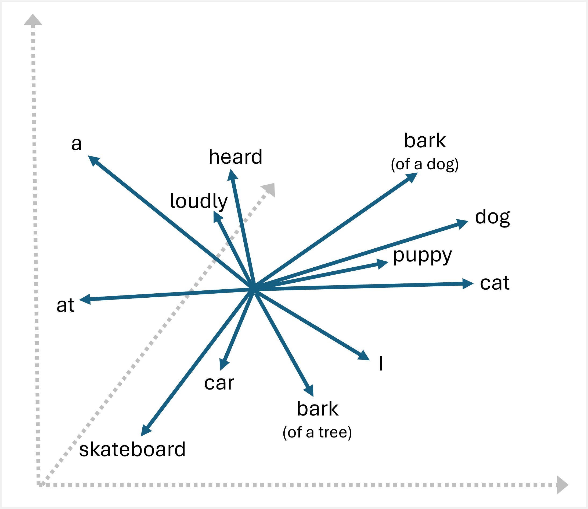

Generative AI applications are powered by *large language models* (LLMs), which are a specialized type of machine learning model that you can use to perform *natural language processing* (NLP) tasks, including:

- Determining *sentiment* or otherwise classifying natural language text.
- Summarizing text.
- Comparing multiple text sources for semantic similarity.
- Generating new natural language.

While the mathematical principles behind these LLMs can be complex, a basic understanding of the architecture used to implement them can help you gain a conceptual understanding of how they work.

## Transformer models

Machine learning models for natural language processing have evolved over many years. Today's cutting-edge large language models are based on the *transformer* architecture, which builds on and extends some techniques that have been proven successful in modeling *vocabularies* to support NLP tasks - and in particular in generating language. Transformer models are trained with large volumes of text, enabling them to represent the semantic relationships between words and use those relationships to determine probable sequences of text that make sense. Transformer models with a large enough vocabulary are capable of generating language responses that are tough to distinguish from human responses.

Transformer model architecture consists of two components, or *blocks*:

- An *encoder* block that creates semantic representations of the training vocabulary.
- A *decoder* block that generates new language sequences.

In practice, the specific implementations of the architecture vary – for example, the Bidirectional Encoder Representations from Transformers (BERT) model developed by Google to support their search engine uses only the encoder block, while the Generative Pretrained Transformer (GPT) model developed by OpenAI uses only the decoder block.

While a complete explanation of every aspect of transformer models is beyond the scope of this module, an explanation of some of the key elements in a transformer can help you get a sense for how they support generative AI.

### Tokenization

The first step in training a transformer model is to decompose the training text into *tokens* - in other words, identify each unique text value. For the sake of simplicity, you can think of each distinct word in the training text as a token (though in reality, tokens can be generated for partial words, or combinations of words and punctuation).

For example, consider the following sentence:

*I heard a dog bark loudly at a cat*

To tokenize this text, you can identify each discrete word and assign token IDs to them. For example:

- I (1)
- heard (2)
- a (3)
- dog (4)
- bark (5)
- loudly (6)
- at (7)
- *("a" is already tokenized as 3)*
- cat (8)

The sentence can now be represented with the tokens: *[1 2 3 4 5 6 7 3 8]*. Similarly, the sentence "I heard a cat" could be represented as *[1 2 3 8]*.

As you continue to train the model, each new token in the training text is added to the vocabulary with appropriate token IDs:

- meow (9)
- skateboard (10)
- *and so on...*

With a sufficiently large set of training text, a vocabulary of many thousands of tokens could be compiled.

### Embeddings

While it may be convenient to represent tokens as simple IDs - essentially creating an index for all the words in the vocabulary, they don't tell us anything about the meaning of the words, or the relationships between them. To create a vocabulary that encapsulates semantic relationships between the tokens, we define contextual vectors, known as *embeddings*, for them. Vectors are multi-valued numeric representations of information, for example [10, 3, 1] in which each numeric element represents a particular attribute of the information. For language tokens, each element of a token's vector represents some semantic attribute of the token. The specific categories for the elements of the vectors in a language model are determined during training based on how commonly words are used together or in similar contexts.

It can be useful to think of the elements in a token embedding vector as *coordinates* in multidimensional space, so that each token occupies a specific "location." The closer tokens are to one another along a particular dimension, the more semantically related they are. In other words, related words are grouped closer together. As a simple example, suppose the embeddings for our tokens consist of vectors with three elements, for example:

- 4 ("dog"): [10.3.2]
- 5 ("bark"): [10,2,2]
- 8 ("cat"): [10,3,1]
- 9 ("meow"): [10,2,1]
- 10 ("skateboard"): [3,3,1]

We can plot the location of tokens based on these vectors in three-dimensional space, like this:

The locations of the tokens in the embeddings space include some information about how closely the tokens are related to one another. For example, the token for "dog" is close to "cat" and also to "bark." The tokens for "cat" and "bark" are close to "meow." The token for "skateboard" is further away from the other tokens.

> [!NOTE]
> The previous example shows a simple example model in which each embedding has only three dimensions. Real language models have many more dimensions.

There are multiple ways you can calculate appropriate embeddings for a given set of tokens, including language modeling algorithms like *Word2Vec* or the *encoder* block in a transformer model.

### Attention

The *encoder* and *decoder* blocks in a transformer model include multiple layers that form the neural network for the model. We don't need to go into the details of all these layers, but it's useful to consider one of the types of layers that is used in both blocks: *attention* layers. Attention is a technique used to examine a sequence of text tokens and try to quantify the strength of the relationships between them. In particular, *self-attention* involves considering how other tokens around one particular token influence that token's meaning.

In an encoder block, attention is used to examine each token in context, and determine an appropriate encoding for its vector embedding. The vector values are based on the relationship between the token and other tokens with which it frequently appears. This contextualized approach means that the same word might have multiple embeddings depending on the context in which it's used - for example "the bark of a tree" means something different to "I heard a dog bark."

In a decoder block, attention layers are used to predict the next token in a sequence. For each token  generated, the model has an attention layer that takes into account the sequence of tokens up to that point. The model considers which of the tokens are the most influential when considering what the next token should be. For example, given the sequence “I heard a dog,” the attention layer might assign greater weight to the tokens “heard” and “dog” when considering the next word in the sequence:

I ***heard*** a ***dog*** [**bark**]

Remember that the attention layer is working with numeric vector representations of the tokens, not the actual text. In a decoder, the process starts with a sequence of token embeddings representing the text to be completed. The first thing that happens is that another *positional encoding* layer adds a value to each embedding to indicate its position in the sequence:

- [***1***,5,6,2]  (I)
- [***2***,9,3,1]  (heard)
- [***3***,1,1,2]  (a)
- [***4***,10,3,2] (dog)

During training, the goal is to predict the vector for the final token in the sequence based on the preceding tokens. The attention layer assigns a numeric *weight* to each token in the sequence so far. It uses that value to perform a calculation on the weighted vectors that produces an *attention score* that can be used to calculate a possible vector for the next token. In practice, a technique called *multi-head attention* uses different elements of the embeddings to calculate multiple attention scores. A neural network is then used to evaluate all possible tokens to determine the most probable token with which to continue the sequence. The process continues iteratively for each token in the sequence, with the output sequence so far being used regressively as the input for the next iteration – essentially building the output one token at a time.

The following animation shows a simplified representation of how this works – in reality, the calculations performed by the attention layer are more complex; but the principles can be simplified as shown:

1.	A sequence of token embeddings is fed into the attention layer. Each token is represented as a vector of numeric values.
2.	The goal in a decoder is to predict the next token in the sequence, which will also be a vector that aligns to an embedding in the model’s vocabulary.
3.	The attention layer evaluates the sequence so far and assigns weights to each token to represent their relative influence on the next token. 
4.	The weights can be used to compute a new vector for the next token with an attention score. Multi-head attention uses different elements in the embeddings to calculate multiple alternative tokens.
5.	A fully connected neural network uses the scores in the calculated vectors to predict the most probable token from the entire vocabulary.
6.	The predicted output is appended to the sequence so far, which is used as the input for the next iteration.

During training, the actual sequence of tokens is known – we just mask the ones that come later in the sequence than the token position currently being considered. As in any neural network, the predicted value for the token vector is compared to the actual value of the next vector in the sequence, and the loss is calculated. The weights are then incrementally adjusted to reduce the loss and improve the model. When used for inferencing (predicting a new sequence of tokens), the trained attention layer applies weights that predict the most probable token in the model’s vocabulary that is semantically aligned to the sequence so far.

What all of this means, is that a transformer model such as GPT-4 (the model behind ChatGPT and Bing) is designed to take in a text input (called a prompt) and generate a syntactically correct output (called a completion). In effect, the “magic” of the model is that it has the ability to string a coherent sentence together. This ability doesn't imply any “knowledge” or “intelligence” on the part of the model; just a large vocabulary and the ability to generate meaningful sequences of words. What makes a large language model like GPT-4 so powerful however, is the sheer volume of data with which it has been trained (public and licensed data from the Internet) and the complexity of the network. This enables the model to generate completions that are based on the relationships between words in the vocabulary on which the model was trained; often generating output that is indistinguishable from a human response to the same prompt.

