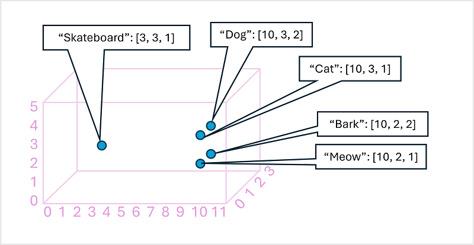

In the beginning of the 2000's, data scientists began to use deep learning algorithms to solve for language learning problems. These approaches are categorized as **Natural language processing** (NLP) methods, which enable machines to process and understand the context of language.

Between 2010 and 2020, language modeling approaches increased in sophistication. One of the key advances in natural language processing was the development of embedding techniques in which text is broken down into tokens (words, phrases, or even partial words).

## Tokens
We call the body of training text the *corpus* and the words that are broken down into their root form *tokens*. Consider the sentence `The sun sets in the west` which breaks down into key tokens `sun`, `set`, and `west`. Tokenization can be broken down into four main steps:

1. Split the words in a text based on a rule. For example, split the words where there's a space between words.
2. Merge similar words by removing the end of a word. This is known as *stemming*.
3. Remove words that have little meaning like `the` and `in`. This is known as *stop word removal*.
4. Assign a number to each unique token.

 

## Embeddings
The Word2Vec algorithm was developed in 2013. It uses a deep learning model to analyze a large corpus of text and assign vector values, such as [3,3,1], to each discrete token. Embeddings are numerical representations of information, which can come in the form of vectors. In this case, these embeddings capture the relationship between words in natural language.

Vectors are assigned to each token during the training process, so that the representation for each token consist of multiple numeric elements. Each element indicates the location of the word along a particular dimension. So for example, the vectors for "cat" and "dog" will likely be closer together along one dimension than, say, "skateboard"; and the vector for "cat" might be close to "meow" one a dimension in which "dog" is close to "bark". That way, we can represent semantic meaning by the distance between vectors. 

The diagram above shows a simple example model in which each embedding has three dimensions. Real language models have many more dimensions; each of which relates to some kind of attribute of the word, such terminology to talk about animals.

## Attention
One of the key elements in advancements in language modeling is attention layers. These layers of mathematical functions enable the model to analyze the sequence of text tokens in context and determine which tokens most influence the next in sequence. For example, given the sequence “I heard a dog”, the attention layer might assign greater weight to the tokens “heard” and “dog” when considering the next word in the sequence, like this:

I heard a dog [bark].

Consider how the next word in the sequence would be different if the model assigned greater weight to "I" and "heard". In that case, the next word could be `fireworks`, but that would not make sense with the full sequence `I heard a dog fireworks`. It’s important to remember that the attention layer is actually working with the vector embeddings, not the actual text and that the next word is a sequence is generated by a numeric calculation.  

