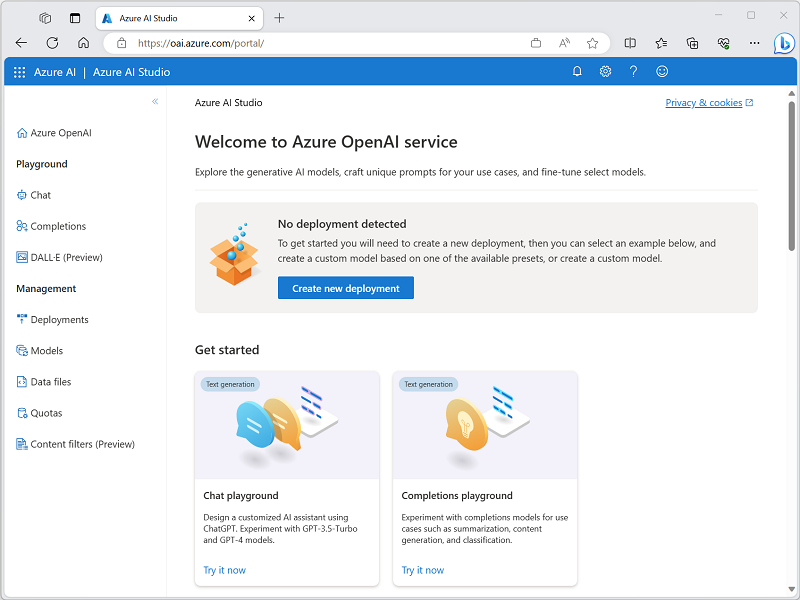

Azure OpenAI Service is Microsoft's cloud solution for deploying, customizing, and hosting large language models. It brings together the best of OpenAI's cutting edge models and APIs with the security and scalability of the Azure cloud platform. Microsoft's partnership with OpenAI enables Azure OpenAI users to access the latest language model innovations.

Azure OpenAI supports many models that can serve different needs. These models include:

- **GPT-4 models** are the latest generation of *generative pretrained* (GPT) models that can generate natural language and code completions based on natural language prompts. Access to GPT-4 models is currently restricted - for access, existing Azure OpenAI customers can apply by [filling out this form](https://aka.ms/oai/get-gpt4).
- **GPT 3.5 models** can generate natural language and code completions based on natural language prompts. In particular, **GPT-35-turbo** models are optimized for chat-based interactions and work well in most generative AI scenarios.
- **Embeddings models** convert text into numeric vectors, and are useful in language analytics scenarios such as comparing text sources for similarities.
- **DALL-E models** are used to generate images based on natural language prompts. Currently, DALL-E models are in preview. DALL-E models aren't listed in the Azure OpenAI Studio interface and don't need to be explicitly deployed.

Models differ by speed, cost, and how well they complete specific tasks. You can learn more about the differences and latest models offered in the [Azure OpenAI Service documentation](/azure/ai-services/openai/concepts/models).

In many cases, models can be used as-is. For example, in Azure OpenAI Service, you can deploy a GPT-4 model and immediately start using it from an application. However, you can also use an existing model as a foundational model - a starting point for further training with your own data. This approach is called fine-tuning, and it enables you to train a custom model that builds on the pre-trained model, but which is tuned to data that is relevant for your particular scenario. For example, a legal firm might fine-tune a model with the text from existing contracts and other proprietary legal documents to train a model that is optimized for generating contractual content.

## Azure AI Studio

Developers can work with these models in Azure AI Studio, a web-based environment where AI professionals can deploy, test, and manage LLMs that support generative AI app development on Azure. 

Within Azure AI Studio, you can deploy large language models, provide few-shot examples, and test them in Azure OpenAI Studio's Chat playground. 

