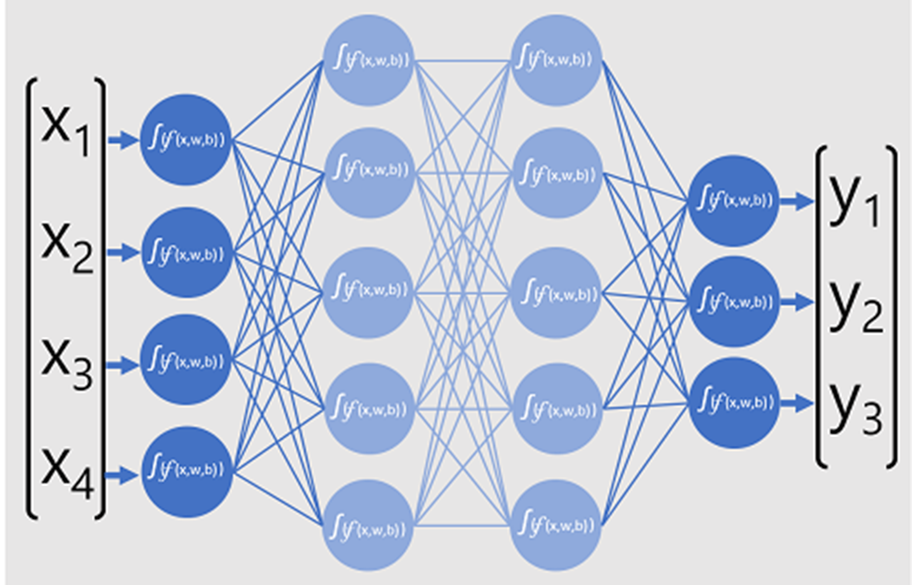

Large language models (LLMs) understand grammar, syntax, semantics, and other language patterns. The model learns the relationship of words to one another by taking in a vast amount of text data. In fact, for the models that we use today to be so good, they use terabytes of text data to train. 

## Neural networks enable calculations 
Neural networks are trained by passing huge volumes of data through multiple layers of "neurons" that apply calculations to data using "weights". The output from the final layer is compared to a known true value and the level of error is used to iteratively adjust the weights so the model predicts more accurately. We can visualize layers as math functions where solving one function is solving one layer, and allows the machine to move onto the next layer, which contains a function. 

Neural networks enable calculations in transformer architecture.

## Transformer architecture captures context
Transformers are deep learning models that pass embedded token vectors to layers that train a model to predict sequences of text tokens – in other words, they can generate language by determining the most probable sequence of words to complete a stream of text. 

The original transformer model architecture defines two blocks of layers: a block of *encoder* layers that generate contextualized token representations for a sequence of text (for example, encoding the word “bark” differently depending on the context within the sequence of words; because “I heard a dog bark” means something different to “the bark of a tree”), and a block of *decoder* layers that take the output of the encoder and iteratively generate a probable output sequence. 

Transformer models use additional attention (particularly self-attention) to predict words from context (e.g. "Use machine leaning to train a model" vs "Catch a train to London") – in other words, the model learns to identify these two different types of “train” as different words with different semantic meaning. 

## Trained models use weights for predictions  
The attention layer applies weights that predict the most probable token in the model’s vocabulary that is semantically aligned to the sequence so far. Mapping huge volume of data enables the model to learn language patterns. The resulting model not only returns a sequence of words, it can return responses that make sense to humans because they are based in existing learned language patterns. 

## Pre-trained transformer models power generative AI today  
GPT models are pre-trained transformer neural networks that interpret words (more accurately, linguistic tokens) as numeric vectors and predict the next in sequence. By using millions of token sequences, the model is trained to apply weights that result in correct predictions of completions (i.e. from a few words, the rest of the sentence can be predicted). 

What all of this means, is that a transformer model such as GPT-4 (the model behind ChatGPT and Bing) is designed to take in a text prompt and generate a syntactically correct output. In effect, the “magic” of the model is that it has the ability to string a coherent sentence together. Note that this does not imply any “knowledge” or “intelligence” on the part of the model; just a large vocabulary and the ability to generate meaningful sequences of words. What makes a large language model like GPT-4 so powerful however, is the sheer volume of data with which it has been trained (public and licensed data from the Internet) and the complexity of the network. To get a sense of a magnitude of difference between models, the GPT-3 model contains 175 billion parameters (weights) while GPT-4 contains trillions. This enables the model to generate completions that are appropriate to the input and rooted in the training text corpus; often generating output that is indistinguishable from a human response to the same prompt.

Common transformer-based LLMs include the BERT model (which is used to power Google search) and GPT models from OpenAI. Next we will see how Microsoft provides access to large language models through Azure OpenAI.
