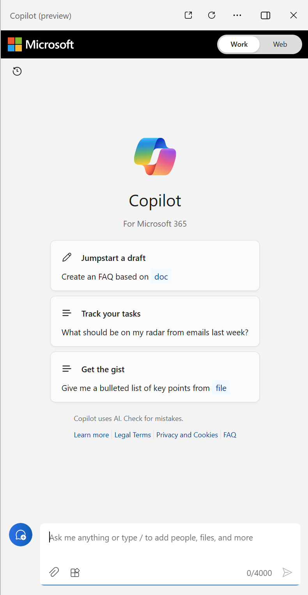

The availability of language models has led to the emergence of new ways to interact with applications and systems through digital *copilots*. Copilots are generative AI assistants that are integrated into applications often as chat interfaces. They provide contextualized support for common tasks in those applications. 

Microsoft offers Microsoft Copilot as a first-party copilot that is integrated into a wide range of Microsoft applications and user experiences. Microsoft Copilot is based on an open architecture that enables third-party developers to create their own plug-ins to extend or customize the user experience with Microsoft Copilot. Additionally, third-party developers can create their own copilots using the same open architecture.

Business users can use copilots to boost their productivity and creativity with AI-generated content and automation of tasks. Developers can extend copilots by creating plug-ins that integrate them into business processes and data, or even create custom copilots to build generative AI capabilities into apps and services.

Copilots have the potential to revolutionize the way we work by helping with first drafts, information synthesis, strategic planning, and much more. The goal of copilot features is to empower people to be smarter, more productive, more creative, and connected to the people and things around them.

## Levels of Copilot adoption

In general, you can categorize industry and personal Copilot adoption into three buckets: off-the-shelf use, extending Microsoft Copilot, and custom development. 

1. You can use off-the-shelf copilots, like Microsoft Copilot for Microsoft 365 to empower users and increase their productivity.
2. You can extend Microsoft Copilot to support custom business processes or tasks, using your own data to control how Copilot responds to user prompts in your organization.
3. You can build custom copilots to integrate generative AI into business apps or to create unique experiences for your customers. 
