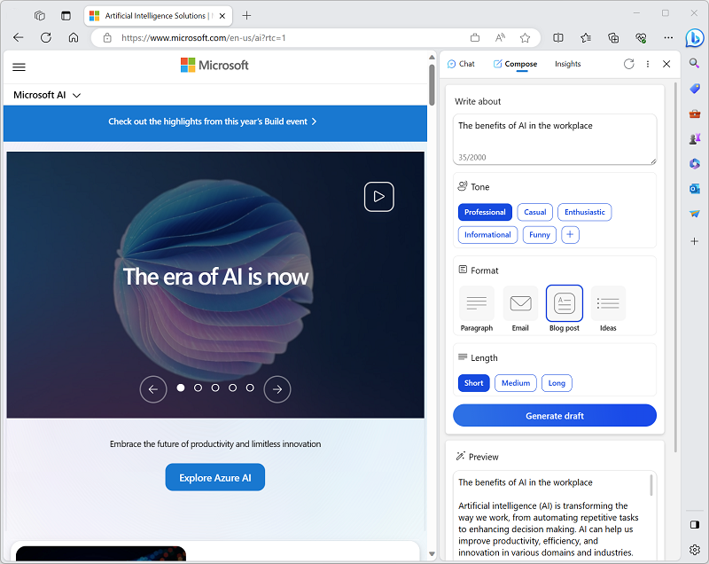
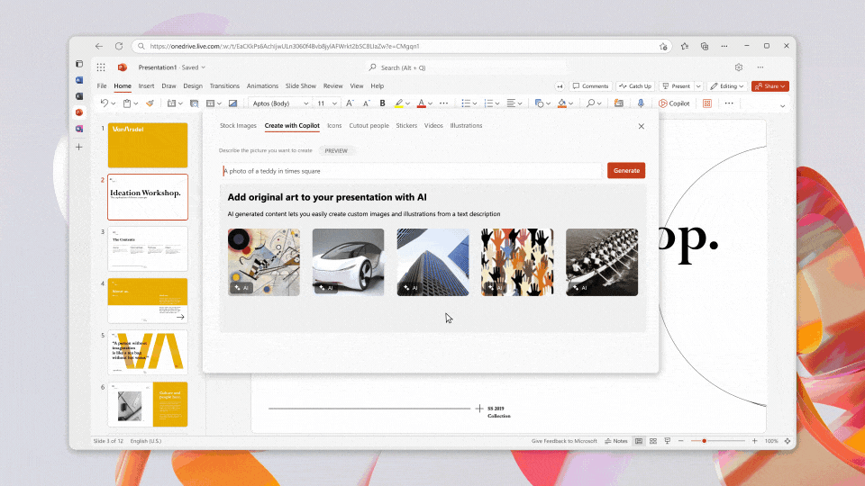
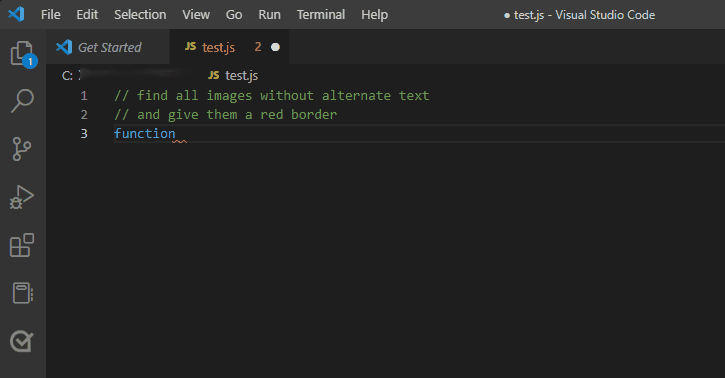

The availability of LLMs has led to the emergence of a new software application, often referred to as a copilot. Copilots are often integrated into other applications and provide a way for users to get help with common tasks from a generative AI model. Copilots are based on a common architecture, so developers can build custom copilots for various business-specific applications and services.

You may see copilots appear within the products that you already use, for example, as a chat screen feature that opens up next to your file. These copilots use the content that is created or searched for in the product as specific information for its results.

It's helpful to think of how the creation of a large language model is related to the process of creating a copilot application: 

1. A large amount of data is used to train a large language model. 
2. Services such as Azure OpenAI Service make pretrained models available. Developers can use these pretrained models as they are, or fine-tune them with custom data.
3. Deploying a model makes it available for use in applications.
4. Developers can build copilots that submit prompts to models and generate content for use in applications.
5. Business users can use copilots to boost their productivity and creativity with AI-generated content.

Copilots have the potential to revolutionize the way we work. These copilots use generative AI to help with first drafts, information synthesis, strategic planning, and much more.  

## Examples of copilots

Microsoft has already added copilots to commonly used applications.

In the Microsoft Edge browser, a copilot enables you to summarize the page you’re currently browsing or to generate new content.

The Microsoft Bing search engine provides a copilot to help when browsing or searching the Internet by generating natural language answers to questions based on context rather than just search results of indexed pages. 

Microsoft 365 copilot works alongside you in productivity and communication apps such as PowerPoint and Outlook, assisting you in creating effective documents, spreadsheets, presentations, emails, and other ways. 

GitHub copilot  provides support to software developers, helping them write, document, and test code.

