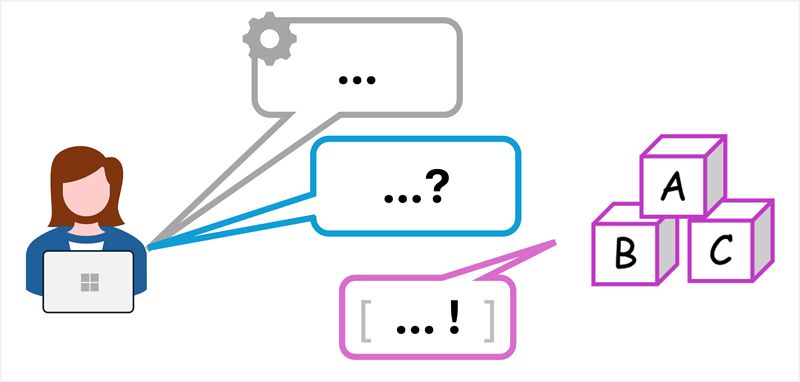
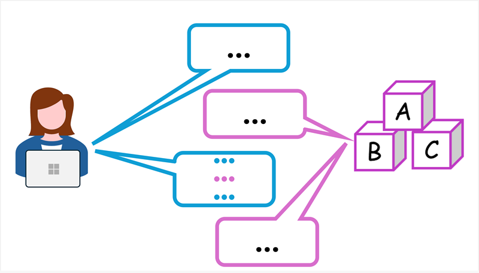
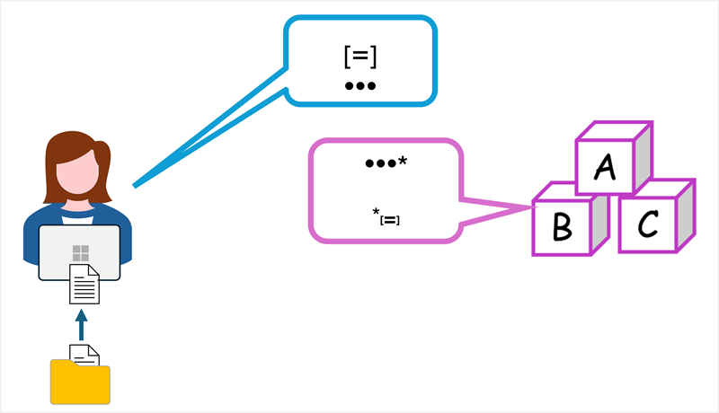

::: zone pivot="video"

>[!VIDEO https://learn-video.azurefd.net/vod/player?id=781d38e5-5a58-4ba9-b6c6-8b7e9f03f5a8]

> [!NOTE]
> See the **Text and images** tab for more details!

::: zone-end

::: zone pivot="text"

A *prompt* is simply the input you give to an LLM to get a response. It might be a question or a command, or just a casual comment to start a conversation. The model responds to a prompt with a *completion*.

## Types of prompt

There are two main types of prompts:

- **System prompts** that set the behavior and tone of the model, and any constraints it should adhere to. For example, "*You're a helpful assistant that responds in a cheerful, friendly manner.*". System prompts determine constraints and styles for the model's responses.
- **User prompts** that elicit a response to a specific question or instruction. For example, "*Summarize the key considerations for adopting generative AI described in <u>GenAI_Considerations.docx</u> for a corporate executive. Format the summary as no more than six bullet points with a professional tone.*".

Usually, the system prompt is set by the application that uses the model. User prompts can be entered by a human user in a chat application; or in some cases generated by the application on the user’s behalf. The model responds to user prompts while obeying the overall guidance in the system prompt.

## Conversation history

To keep a conversation consistent and relevant, generative AI apps often keep track of the conversation history; and include summarized versions of it in subsequent prompts. This ensures there’s an ongoing context for the conversation that the model can build on.

For example, suppose the model responds to the system and user prompts described previously with the following completion:

> *Key considerations for adopting Generative AI include:*
>
> - *Establish Clear Governance and Responsible AI Policies*
> - *Prioritize High-Value Use Cases Across Corporate Functions*
> - *Mitigate Risks Around Privacy, Security, and Compliance*
> - *Foster Organizational Readiness and Cultural Adaptation*
> - *Measure Impact and Build Accountability*
> - *Stay Ahead of Strategic and Competitive Shifts*

You could respond with a follow-up question, such as "*What are common privacy-related risks?*. The prompt would include the new question, but also the previous prompts and responses; providing context to the model so that it understands the question in relation to Generative AI adoption.

## Retrieval augmented generation (RAG)

To add even more context, generative AI applications can use a technique called *retrieval augmented generation (RAG)*. This approach involves retrieving information, like documents or emails, and using it to augment the prompt with relevant data. The response generated by the model is then *grounded* in the information that was provided.

For example, suppose you submit a prompt like "*What's the maximum I can claim for travel expenses on a business trip?*". With no other information, a model will respond with a generic answer - probably telling you to consult your organization's expenses policy documentation. A better solution would be to build an expenses assistant app that initially queries the organization's expenses policy documentation, retrieving sections related to "travel expenses"; and then includes the retrieved information in the prompt that is sent to the model, along with your original question. Now the model can use the expenses policy information in the prompt to provide context, and respond with a more relevant answer.

## Tips for better prompts

The quality of responses from generative AI assistants not only depends on the language model used, but on the prompts you submit to it.

To get better results from your prompts:

- Be **clear** and **specific** – prompts with explicit instructions or questions work better than vague language.
- Add **context** - mention the topic, audience, or format you want.
- Use **examples**, If you want a certain style, provide an example of what you mean.
- Ask for **structure**, Like bullet points, tables, or numbered lists.

Using well-designed prompts can make a huge difference to the results you’ll get from your generative AI model.

::: zone-end