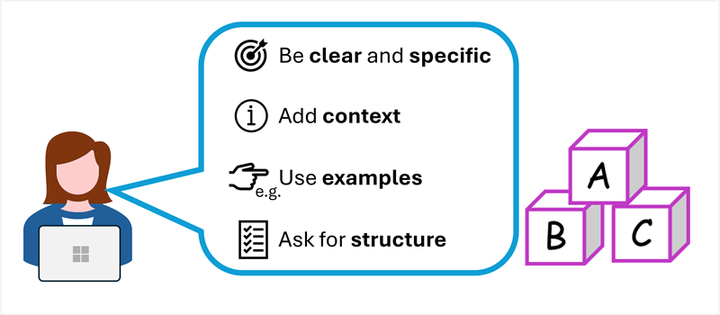

The quality of responses from copilots not only depends on the language model used, but on the types of prompts users provide. Prompts are ways we tell an application what we want it to do. You can get the most useful completions by being explicit about the kind of response you want. Take this example, "Summarize the key considerations for adopting Copilot described in this document for a corporate executive. Format the summary as no more than six bullet points with a professional tone." You can achieve better results when you submit clear, specific prompts.

Consider the following ways you can improve the response a copilot provides:

1. Start with a specific goal for what you want the copilot to do
2. Provide a source to ground the response in a specific scope of information
3. Add context to maximize response appropriateness and relevance
4. Set clear expectations for the response
5. Iterate based on previous prompts and responses to refine the result

In most cases, a copilot doesn't just send your prompt as-is to the language model. Usually, your prompt is augmented with:
- A *system message* that sets conditions and constraints for the language model behavior. For example, "You're a helpful assistant that responds in a cheerful, friendly manner." These system messages determine constraints and styles for the model's responses.
- The conversation history for the current session, including past prompts and responses. The history enables you to refine the response iteratively while maintaining the context of the conversation.
- The current prompt – potentially optimized by the copilot to reword it appropriately for the model or to add more grounding data to scope the response.

The term *prompt engineering* describes the process of prompt improvement. Both developers who design applications and consumers who use those applications can improve the quality of responses from generative AI by considering prompt engineering.