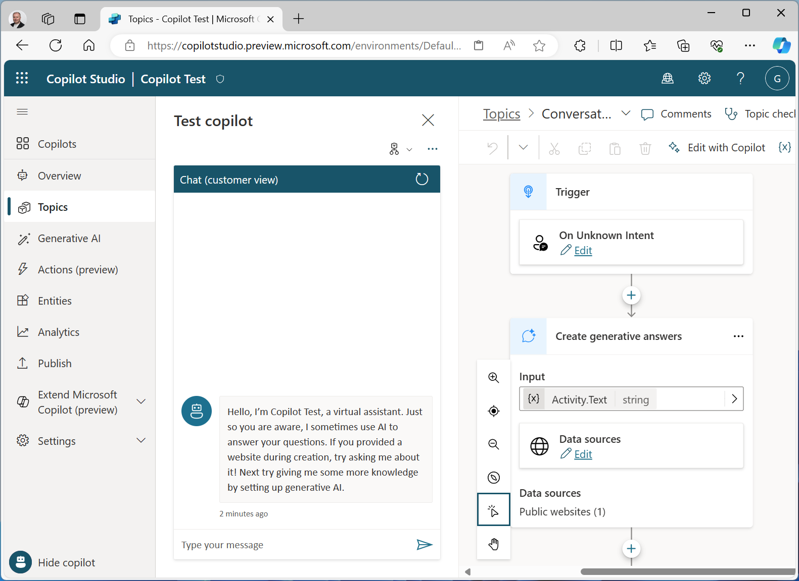

If your organization makes the decision to extend Microsoft Copilot or develop copilot-like agents, Microsoft provides two tools that you can use, Copilot Studio and Azure AI Foundry.

## Copilot Studio

*Copilot Studio* is designed to work well for low-code development scenarios in which technically proficient business users or developers can create conversational AI experiences. The resulting agent is a fully managed SaaS (software as a service) solution, hosted in your Microsoft 365 environment and delivered through chat channels like Microsoft Teams. With Copilot Studio, the infrastructure considerations and model deployment details are taken care of for you, making it easy to focus on creating an effective solution. For more information, see https://www.microsoft.com/microsoft-copilot/microsoft-copilot-studio.
 

## Azure AI Foundry

*Azure AI Foundry* is a PaaS (platform as a service) platform for developers that gives you full control over the language models you want to use, including the capability to fine-tune the models with your own data. You can define prompt flows, orchestrate conversation flow, integrate your own data augmentation and prompt engineering logic, and you can deploy the resulting copilot service in the cloud and consume it from custom-developed apps and services. Learn more about Azure AI Foundry [here](/azure/ai-studio/what-is-ai-studio).

