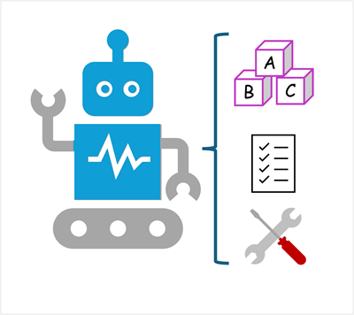
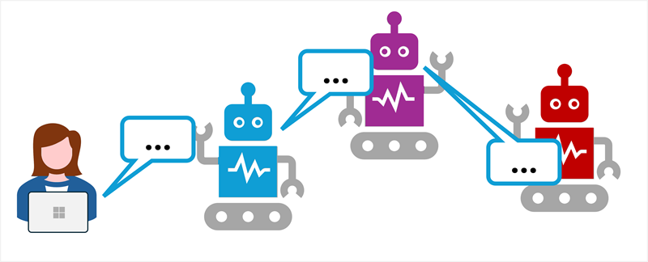

::: zone pivot="video"

>[!VIDEO https://learn-video.azurefd.net/vod/player?id=6ee42a95-da4a-46bf-9cad-0ef84acf8922]

> [!NOTE]
> See the **Text and images** tab for more details!

::: zone-end

::: zone pivot="text"

Imagine having a digital assistant that doesn’t just answer questions, but actually gets things done! Welcome to the world of AI agents.

Agents are software applications built on generative AI that can reason over and generate natural language, automate tasks by using tools, and respond to contextual conditions to take appropriate action.

## Components of an AI agent

AI agents have three key elements:

- **A large language model**: This is the agent's brain; using generative AI for language understanding and reasoning.
- **Instructions**: A system prompt that defines the agent’s role and behavior. Think of it as the agent’s job description.
- **Tools**: These are what the agent uses to interact with the world. Tools can include:
    - *Knowledge* tools that provide access to information, like search engines or databases.
    - *Action* tools that enable the agent to perform tasks, such as sending emails, updating calendars, or controlling devices.

With these capabilities, AI agents can take on the role of digital assistants that intelligently automate tasks and collaborate with you to work smarter and more efficiently.

## Multi-agent systems

Agents can also work with one another, in multi-agent systems. Instead of one agent doing everything, multiple agents can collaborate—each with its own specialty. One might gather data, another might analyze it, and a third might take action. Together, they form an AI-powered workforce that can handle complex workflows, just like a human team.

Agents communicate with each other through prompts, using generative AI to determine what tasks are required and which agents are responsible for completing them.

Agentic AI is set to be the next advance in how we use technology to find information and get work done. 

::: zone-end