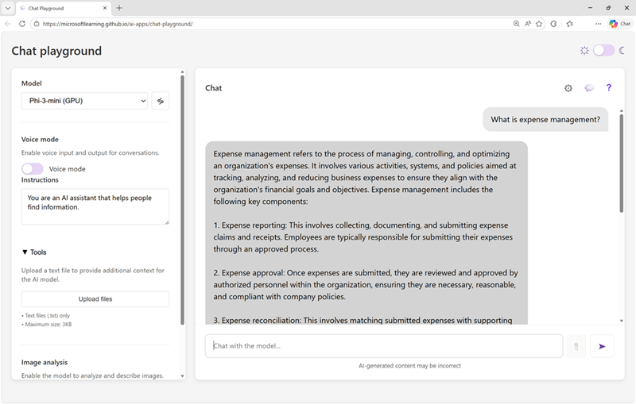

Now it's your chance to explore generative AI!

In this exercise, you'll use a chat playground to interact with a generative AI model, and observe the effect of system prompts, model parameters, and grounding the model with data.

*Use the following button to start the exercise*

