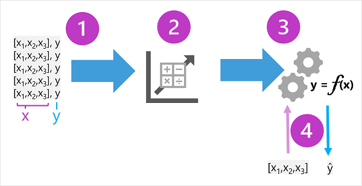

::: zone pivot="video"

>[!VIDEO https://learn-video.azurefd.net/vod/player?id=c997e945-2453-46d8-a26d-f09e6191df69]

> [!NOTE]
> See the **Text and images** tab for more details!

::: zone-end

::: zone pivot="text"

Because machine learning is based on mathematics and statistics, it's common to think about machine learning models in mathematical terms. Fundamentally, a machine learning model is a software application that encapsulates a *function* to calculate an output value based on one or more input values. The process of defining that function is known as *training*. After the function has been defined, you can use it to predict new values in a process called *inferencing*.

Let's explore the steps involved in training and inferencing.

1. The training data consists of past observations. In most cases, the observations include the observed attributes or *features* of the thing being observed, and the known value of the thing you want to train a model to predict (known as the *label*).

    In mathematical terms, you'll often see the features referred to using the shorthand variable name ***x***, and the label referred to as ***y***. Usually, an observation consists of multiple feature values, so ***x*** is actually a *vector* (an array with multiple values), like this: ***[x1,x2,x3,...]***.

    To make this clearer, let's consider the examples described previously:
    - In the ice cream sales scenario, our goal is to train a model that can predict the number of ice cream sales based on the weather. The weather measurements for the day (temperature, rainfall, windspeed, and so on) would be the *features* (***x***), and the number of ice creams sold on each day would be the *label* (***y***).
    - In the medical scenario, the goal is to predict whether or not a patient is at risk of diabetes based on their clinical measurements. The patient's measurements (weight, blood glucose level, and so on) are the *features* (***x***), and the likelihood of diabetes (for example, *1* for at risk, *0* for not at risk) is the *label* (***y***).
    - In the Antarctic research scenario, we want to predict the species of a penguin based on its physical attributes. The key measurements of the penguin (length of its flippers, width of its bill, and so on) are the *features* (***x***), and the species (for example, *0* for Adelie, *1* for Gentoo, or *2* for Chinstrap) is the *label* (***y***).
1. An *algorithm* is applied to the data to try to determine a relationship between the features and the label, and generalize that relationship as a calculation that can be performed on ***x*** to calculate ***y***. The specific algorithm used depends on the kind of predictive problem you're trying to solve (more about this later), but the basic principle is to try to *fit* the data to a function in which the values of the features can be used to calculate the label.
1. The result of the algorithm is a *model* that encapsulates the calculation derived by the algorithm as a *function* - let's call it ***f***. In mathematical notation:

    ***y = f(x)***

1. Now that the *training* phase is complete, the trained model can be used for *inferencing*. The model is essentially a software program that encapsulates the function produced by the training process. You can input a set of feature values, and receive as an output a prediction of the corresponding label. Because the output from the model is a prediction that was calculated by the function, and not an observed value, you'll often see the output from the function shown as ***&#375;*** (which is rather delightfully verbalized as "y-hat").

::: zone-end