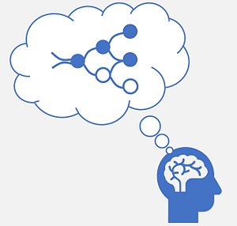
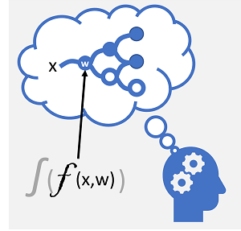
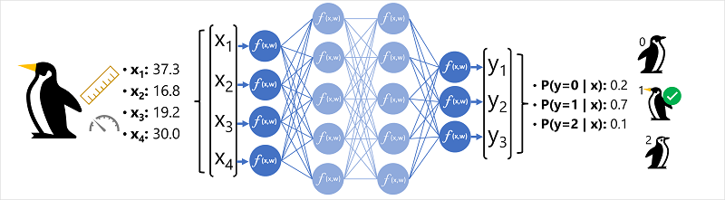
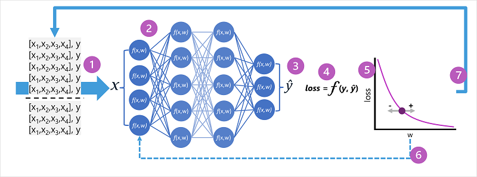

*Deep learning* is an advanced form of machine learning that tries to emulate the way the human brain learns. The key to deep learning is the creation of an artificial *neural network* that simulates electrochemical activity in biological neurons by using mathematical functions, as shown here.

| Biological neural network | Artificial neural network |
|-|-|
|||
| Neurons fire in response to electrochemical stimuli. When fired, the signal is passed to connected neurons.| Each neuron is a function that operates on an input value (***x***) and a *weight* (***w***). The function is wrapped in an *activation* function that determines whether to pass the output on.|

Artificial neural networks are made up of multiple *layers* of neurons - essentially defining a deeply nested function. This architecture is the reason the technique is referred to as *deep learning* and the models produced by it are often referred to as *deep neural networks* (DNNs). You can use deep neural networks for many kinds of machine learning problem, including regression and classification, as well as more specialized models for natural language processing and computer vision.

Just like other machine learning techniques discussed in this module, deep learning involves fitting training data to a function that can predict a label (***y***) based on the value of one or more features (***x***). The function (***f(x)***) is the outer layer of a nested function in which each layer of the neural network encapsulates functions that operate on ***x*** and the weight (***w***) values associated with them. The algorithm used to train the model involves iteratively feeding the feature values (***x***) in the training data forward through the layers to calculate output values for ***&#375;***, validating the model to evaluate how far off the calculated ***&#375;*** values are from the known ***y*** values (which quantifies the level of error, or *loss*, in the model), and then modifying the weights (***w***) to reduce the loss. The trained model includes the final weight values that result in the most accurate predictions.

## Example - Using deep learning for classification

To better understand how a deep neural network model works, let's explore an example in which a neural network is used to define a classification model for penguin species.

The feature data (***x***) consists of some measurements of a penguin. Specifically, the measurements are:

- The length of the penguin's bill.
- The depth of the penguin's bill.
- The length of the penguin's flippers.
- The penguin's weight.

In this case, ***x*** is a vector of four values, or mathematically, ***x=[x1,x2,x3,x4]***.

The label we're trying to predict (***y***) is the species of the penguin, and that there are three possible species it could be:

- Adelie
- Gentoo
- Chinstrap

This is an example of a classification problem, in which the machine learning model must predict the most probable class to which an observation belongs. A classification model accomplishes this by predicting a label that consists of the probability for each class. In other words, y is a vector of three probability values; one for each of the possible classes: ***[P(y=0|x), P(y=1|x), P(y=2|x)]***.

The process for inferencing a predicted penguin class using this network is:

1. The feature vector for a penguin observation is fed into the input layer of the neural network, which consists of a neuron for each ***x*** value. In this example, the following ***x*** vector is used as the input: ***[37.3, 16.8, 19.2, 30.0]***
2. The functions for the first layer of neurons each calculate a weighted sum by combining the ***x*** value and ***w*** weight, and pass it to an activation function that determines if it meets the threshold to be passed on to the next layer.
3. Each neuron in a layer is connected to all of the neurons in the next layer (an architecture sometimes called a *fully connected network*) so the results of each layer are fed forward through the network until they reach the output layer.
4. The output layer produces a vector of values; in this case, using a *softmax* or similar function to calculate the probability distribution for the three possible classes of penguin. In this example, the output vector is: ***[0.2, 0.7, 0.1]***
5. The elements of the vector represent the probabilities for classes 0, 1, and 2. The second value is the highest, so the model predicts that the species of the penguin is **1** (Gentoo).

### How does a neural network learn?

The weights in a neural network are central to how it calculates predicted values for labels. During the training process, the model *learns* the weights that will result in the most accurate predictions. Let's explore the training process in a little more detail to understand how this learning takes place.

1. The training and validation datasets are defined, and the training features are fed into the input layer.
1. The neurons in each layer of the network apply their weights (which are initially assigned randomly) and feed the data through the network.
1. The output layer produces a vector containing the calculated values for ***&#375;***. For example, an output for a penguin class prediction might be ***[0.3. 0.1. 0.6]***.
1. A *loss function* is used to compare the predicted ***&#375;*** values to the known ***y*** values and aggregate the difference (which is known as the *loss*). For example, if the known class for the case that returned the output in the previous step is *Chinstrap*, then the ***y*** value should be ***[0.0, 0.0, 1.0]***. The absolute difference between this and the ***&#375;*** vector is ***[0.3, 0.1, 0.4]***. In reality, the loss function calculates the aggregate variance for multiple cases and summarizes it as a single *loss* value.
1. Since the entire network is essentially one large nested function, an optimization function can use differential calculus to evaluate the influence of each weight in the network on the loss, and determine how they could be adjusted (up or down) to reduce the amount of overall loss. The specific optimization technique can vary, but usually involves a *gradient descent* approach in which each weight is increased or decreased to minimize the loss.
1. The changes to the weights are *backpropagated* to the layers in the network, replacing the previously used values.
1. The process is repeated over multiple iterations (known as *epochs*) until the loss is minimized and the model predicts acceptably accurately.

> [!NOTE]
> While it's easier to think of each case in the training data being passed through the network one at a time, in reality the data is batched into matrices and processed using linear algebraic calculations. For this reason, neural network training is best performed on computers with graphical processing units (GPUs) that are optimized for vector and matrix manipulation.
