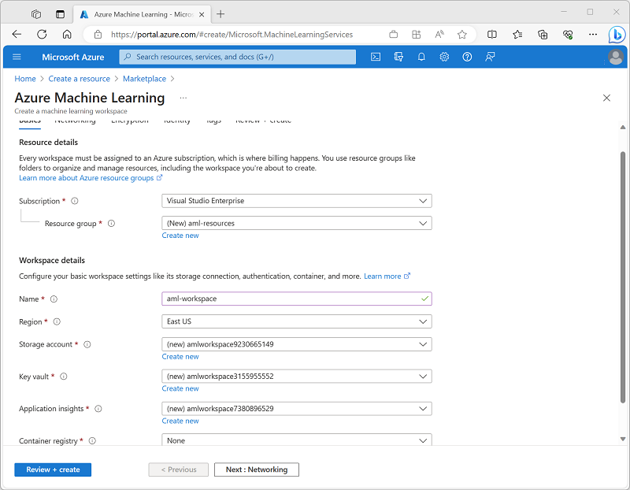
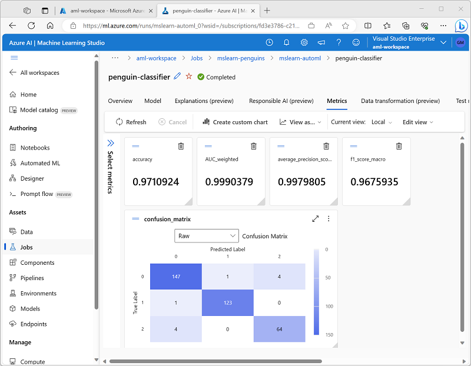

Microsoft Azure Machine Learning is a cloud service for training, deploying, and managing machine learning models. It's designed to be used by data scientists, software engineers, devops professionals, and others to manage the end-to-end lifecycle of machine learning projects, including:

- Exploring data and preparing it for modeling.
- Training and evaluating machine learning models.
- Registering and managing trained models.
- Deploying trained models for use by applications and services.
- Reviewing and applying responsible AI principles and practices.

## Features and capabilities of Azure Machine Learning

Azure Machine Learning  provides the following features and capabilities to support machine learning workloads:

- Centralized storage and management of datasets for model training and evaluation.
- On-demand compute resources on which you can run machine learning jobs, such as training a model.
- Automated machine learning (AutoML), which makes it easy to run multiple training jobs with different algorithms and parameters to find the best model for your data.
- Visual tools to define orchestrated *pipelines* for processes such as model training or inferencing.
- Integration with common machine learning frameworks such as MLflow, which make it easier to manage model training, evaluation, and deployment at scale.
- Built-in support for visualizing and evaluating metrics for responsible AI, including model explainability, fairness assessment, and others.

## Provisioning Azure Machine Learning resources

The primary resource required for Azure Machine Learning is an *Azure Machine Learning workspace*, which you can provision in an Azure subscription. Other supporting resources, including storage accounts, container registries, virtual machines, and others are created automatically as needed.

To create an Azure Machine Learning workspace, you can use the Azure portal, as shown here:

## Azure Machine Learning studio

After you've provisioned an Azure Machine Learning workspace, you can use it in *Azure Machine Learning studio*; a browser-based portal for managing your machine learning resources and jobs.

In Azure Machine Learning studio, you can (among other things):

- Import and explore data.
- Create and use compute resources.
- Run code in notebooks.
- Use visual tools to create jobs and pipelines.
- Use automated machine learning to train models.
- View details of trained models, including evaluation metrics, responsible AI information, and training parameters.
- Deploy trained models for on-request and batch inferencing.
- Import and manage models from a comprehensive model catalog.

The screenshot shows the **Metrics** page for a trained model in Azure Machine Learning studio, in which you can see the evaluation metrics for a trained multiclass classification model.
