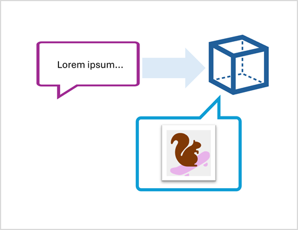

Azure AI Foundry enables you to use language models to generate content based on natural language prompts. Often the content that is generated is in the form of natural language text, but increasingly, models can generate other kinds of content.

For example, the OpenAI DALL-E image generation model is capable of creating original graphical content based on natural language descriptions of a desired image.

The ability to use AI to generate graphics has a number of applications; including the creation of illustrations or photorealistic images for articles or marketing collateral, generation of unique product or company logos, or any scenario where a desired image can be described.

In this module, you'll learn how to develop an application that uses generative AI to generate original images.
