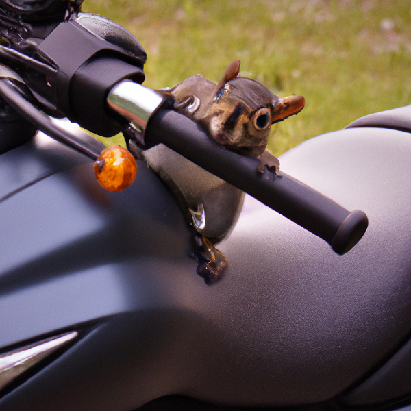

DALL-E is a neural network based model that can generate graphical data from natural language input. Put more simply, you can provide DALL-E with a description and it can generate an appropriate image.

For example, you might submit the following natural language prompt to DALL-E:

*A squirrel on a motorcycle*

This prompt could result in the generation of graphical output such as the following image:

The images generated by DALL-E are original; they are not retrieved from a curated image catalog. In other words, DALL-E is not a search system for *finding* appropriate images - it is an artificial intelligence (AI) model that *generates* new images based on the data on which it was trained.
