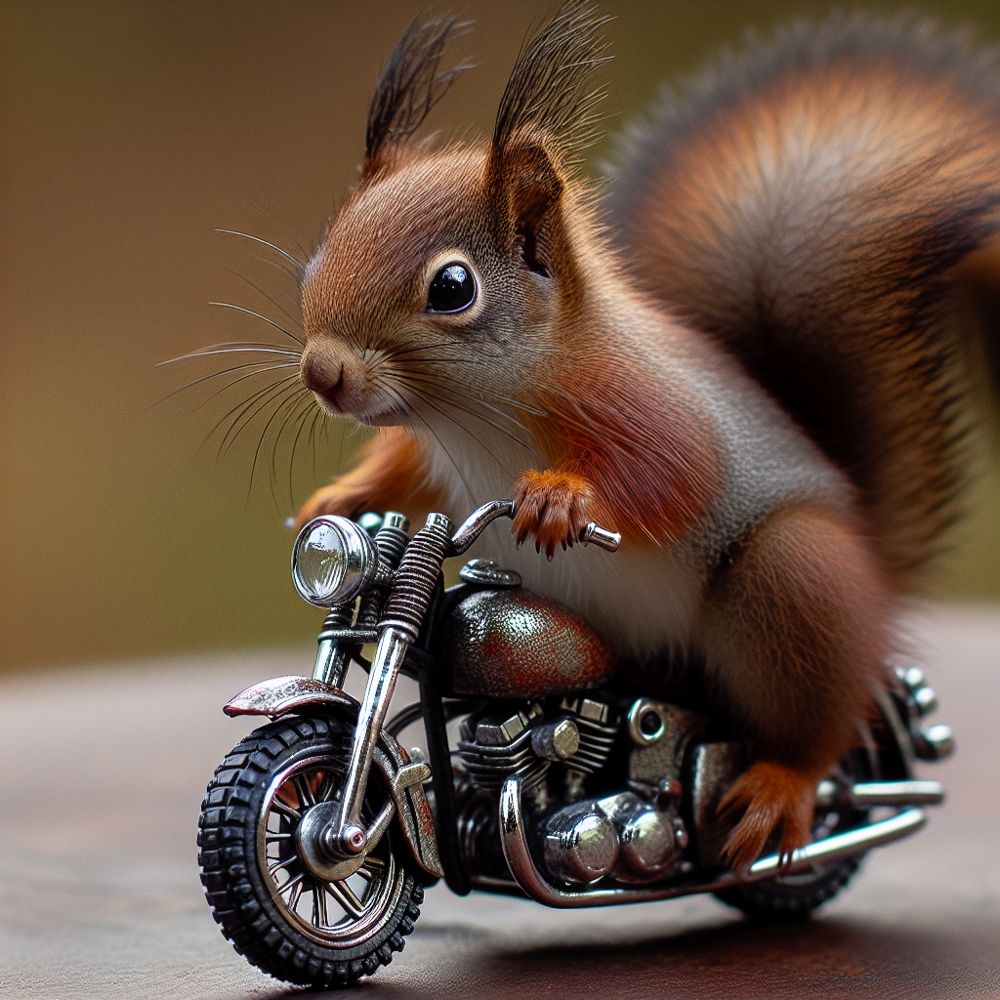

Azure AI Foundry supports multiple models that are capable of generating images, including (but not limited to):

- DALL-E 3
- GPT-Image 1

> [!TIP]
> For the latest information about model availability in Azure AI Foundry, view the model catalog. See **[Model catalog and collections in Azure AI Foundry portal](/azure/ai-foundry/how-to/model-catalog-overview?azure-portal=true)** for details.

Image generation models are generative AI model that can create graphical data from natural language input. Put more simply, you can provide the model with a description and it can generate an appropriate image.

For example, you might submit the following natural language prompt to an image generation model:

*A squirrel on a motorcycle*

This prompt could result in the generation of graphical output such as the following image:

The images generated are original; they aren't retrieved from a curated image catalog. In other words, the model isn't a search system for *finding* appropriate images - it is an artificial intelligence (AI) model that *generates* new images based on the data on which it was trained.
