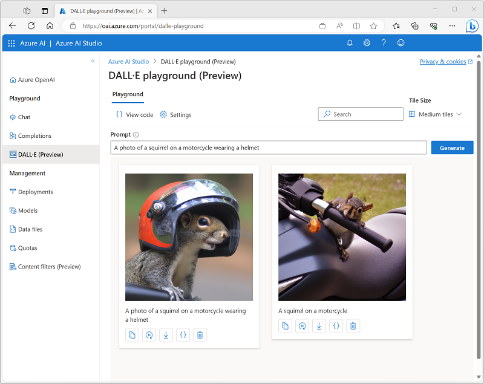

To experiment with DALL-E, you can provision an Azure OpenAI Service resource in an Azure subscription that has been approved for access to the service, and use the *DALL-E playground* to submit prompts and view the resulting generated images.

When using the playground, you can adjust the **settings** to specify:

- The number of images to be generated in response to a prompt (the default number of images is one).
- The resolution (size) of the generated image(s). Available sizes are *256x256*, *512x512*, or *1024x1024* (which is the default value).
