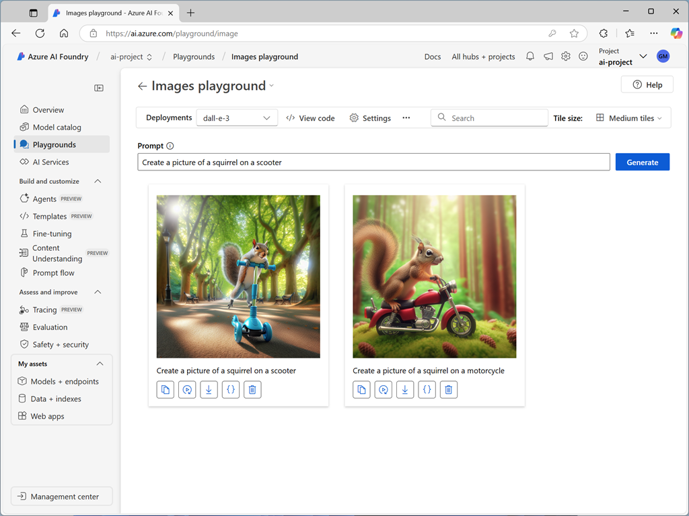

To experiment with image generation models, you can create an Azure AI Foundry project (or provision an Azure OpenAI Service resource in an Azure subscription) and use the *Images playground* in Azure AI Foundry portal to submit prompts and view the resulting generated images.

When using the playground, you can adjust the **settings** to control the output. For example, when using a DALL-E model you can specify:

- The resolution (size) of the generated images. Available sizes are `1024x1024` (which is the default value), `1792x1024`, or `1024x1792`.
- The image style to be generated (such as `vivid` or `natural`).
- The image quality (choose from `standard` or `hd`).
