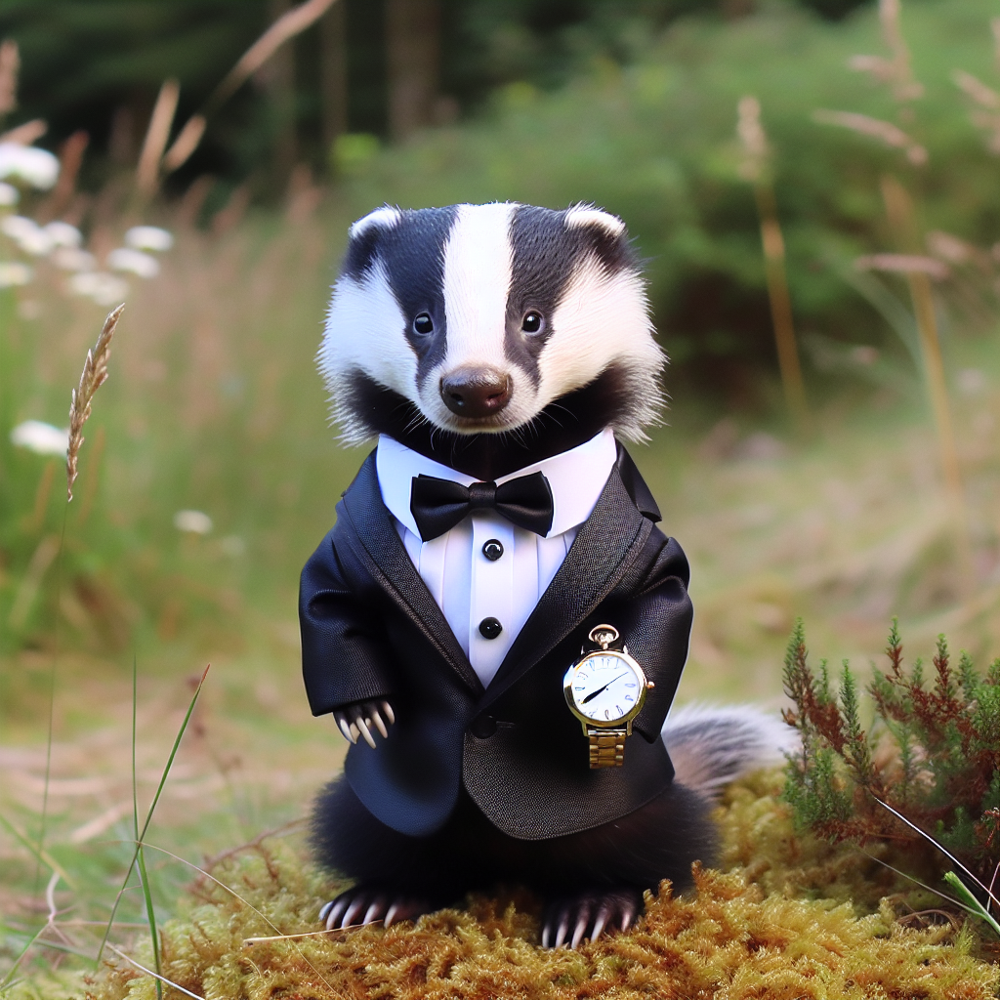

You can use the Azure OpenAI service REST API to consume DALL-E models from applications.

To make a REST call to the service, you need the endpoint and authorization key for the Azure OpenAI Service resource you have provisioned in Azure. You initiate the image generation process by submitting a POST request to the service endpoint with the authorization key in the header. The request must contain the following parameters in a JSON body:

- **prompt**: The description of the image to be generated.
- **n**: The number of images to be generated. DALL-E 3 only supports n=1.
- **size**: The resolution of the image(s) to be generated (*1024x1024*, *1792x1024*, or *1024x1792* for DALL-E 3; *256x256*, *512x512*, or *1024x1024* for DALL-E 2).
- **quality** *Optional*: The quality of the image (*standard* or *hd*). Defaults to *standard*.
- **style** *Optional*: The visual style of the image (*natural* or *vivid*). Defaults to *vivid*.

For example, the following JSON could be used to generate an 512 x 512 image of a badger wearing a tuxedo:

```json
{
    "prompt": "A badger wearing a tuxedo",
    "n": 1,
    "size": "512x512",
    "quality": "hd", 
    "style": "vivid"
}
```

If you're using an older generation model such as DALL-E 2, the initial request does not immediately return the results of the image generation process. Instead, the response includes an **operation-location** header with a URL for a callback service that your application code can poll until the results of image generation are ready.

With DALL-E 3, the result from the request is processed synchronously with the response containing the URL for the generated image. The response is similar to the following JSON:

```json
{
    "created": 1686780744,
    "data": [
        {
            "url": "<URL of generated image>",
            "revised_prompt": "<prompt that was used>"
        }
    ]
}
```

The **data** element includes the **url** value, which references a PNG image file generated from the prompt that you can then view or download. The response also contains a **revised prompt** that was used to generate the image, which was updated by the system to achieve the most desirable results. In this example, the image might look similar to the following image:


