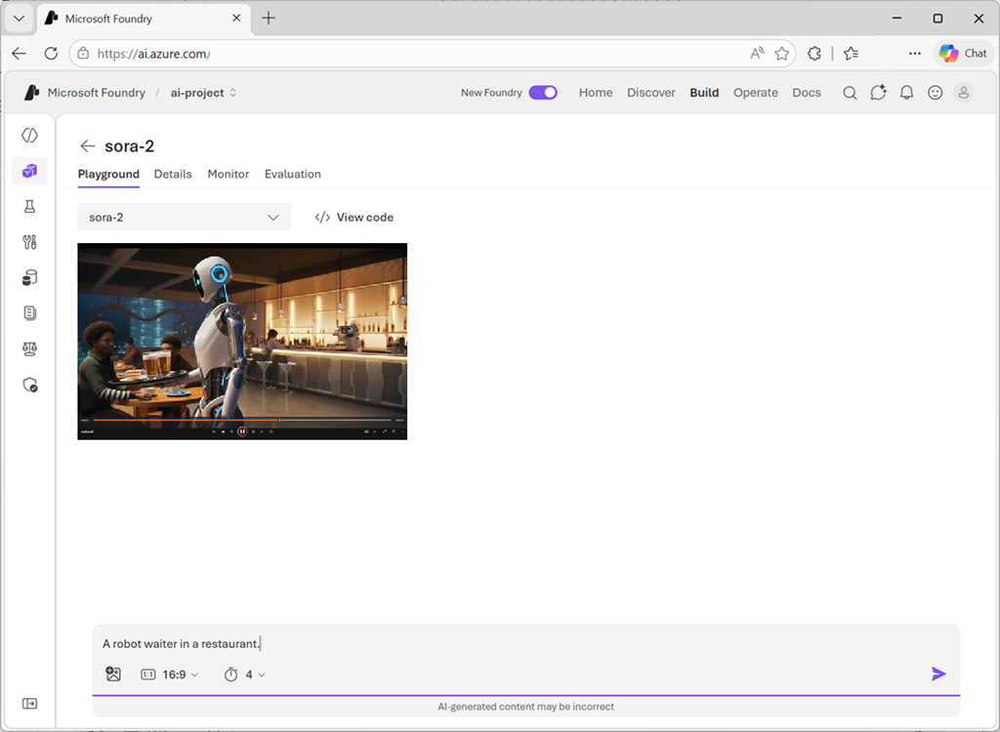

Once your Sora 2 model is deployed, you can start generating videos. Video generation is an asynchronous process—you submit a request with your prompt and video settings, then retrieve the completed video when it's ready.

## Video generation parameters

Before crafting your prompt, understand the API parameters that control your video output:

| Parameter | Description | Supported values |
|-----------|-------------|------------------|
| **prompt** | Natural language description of your video | Text string (required) |
| **model** | The model to use | `sora-2` or `sora-2-pro` |
| **size** | Output resolution | `1280x720` (landscape), `720x1280` (portrait) |
| **seconds** | Video duration | `4`, `8`, or `12` (default: 4) |
| **input_reference** | Reference image for the first frame | JPEG, PNG, or WebP file |
| **remix_video_id** | ID of a previous video to remix | Video ID string |

> [!TIP]
> The model follows instructions more reliably in shorter clips. For best results, consider generating two 4-second clips and stitching them together rather than a single 8-second clip.

## Test video generation in the playground

After deploying the Sora 2 model, you can test it using the Video playground in Microsoft Foundry portal:



1. Navigate to your deployed Sora 2 model in the Foundry portal.
1. Select the **Playground** tab to access the video generation interface.
1. Enter your prompt into the text box describing the video you want to generate.
1. Configure video settings such as resolution and duration.
1. Select **Generate** to start video creation.

Video generation typically takes 1 to 5 minutes depending on your settings. When the AI-generated video is ready, it appears on the page.

> [!NOTE]
> The content generation APIs include a content moderation filter. If Azure OpenAI recognizes your prompt as harmful content, it won't return a generated video. For more information, see [Content filtering](/azure/ai-services/openai/concepts/content-filter).

In the video playground, you can also view cURL code samples that are prefilled according to your settings. Select the **View code** button at the top of the playground to access sample code you can use in your applications.

## Writing effective prompts

Think of prompting like briefing a cinematographer. The more specific you are about what the shot should achieve, the more control and consistency you'll get. However, leaving some details open can lead to creative, unexpected results.

### Prompt anatomy

A clear prompt describes a shot as if you were sketching it onto a storyboard:

- **Camera framing**: Specify the shot type (wide, medium, close-up) and angle
- **Subject description**: Anchor your subject with distinctive details
- **Action**: Describe movement in beats—small steps, gestures, or pauses
- **Lighting and palette**: Set the mood with lighting direction and color anchors
- **Style**: Establish the aesthetic early (for example, "1970s film" or "handheld documentary")

### Weak vs. strong prompts

| Weak prompt | Strong prompt |
|-------------|---------------|
| "A beautiful street at night" | "Wet asphalt, zebra crosswalk, neon signs reflecting in puddles" |
| "Person moves quickly" | "Cyclist pedals three times, brakes, and stops at crosswalk" |
| "Cinematic look" | "Anamorphic 2.0x lens, shallow DOF, volumetric light" |

### Example prompt

Here's an example of a well-structured prompt:

```text
In a 90s documentary-style interview, an old Swedish man sits in a study 
and says, "I still remember when I was young."
```

This prompt works because:

- "90s documentary" sets the style, so the model chooses appropriate camera, lighting, and color
- "old Swedish man sits in a study" describes subject and setting while allowing creative interpretation
- The dialogue gives the model specific words to sync with the character

## Using reference images

For more control over composition and style, use the `input_reference` parameter to provide a visual reference. The model uses the image as an anchor for the first frame, while your prompt defines what happens next.

Requirements for reference images:

- The image resolution must match the target video size (`1280x720` or `720x1280`)
- Supported formats: JPEG, PNG, WebP

## Remixing existing videos

The remix feature lets you modify specific aspects of an existing video while preserving its core elements—scene transitions, visual layout, and overall structure. This is useful for making targeted adjustments without regenerating from scratch.

To remix a video:

1. Generate a video and note its video ID from the completed job
2. Call the remix endpoint with the original video ID and an updated prompt
3. Describe only the changes you want—keep modifications focused

For best results:

- Limit changes to one clearly articulated adjustment
- Be specific about what to change: "same shot, switch to 85mm lens" or "same lighting, new palette: teal, sand, rust"
- Narrow, precise edits retain greater fidelity to the source material

## Tips for better results

- **Keep it simple**: Each shot should have one clear camera move and one clear subject action
- **Use beats for timing**: Instead of "actor walks across the room," try "actor takes four steps to the window, pauses, and pulls the curtain"
- **Be consistent**: Reuse phrasing for characters across shots to maintain continuity
- **Iterate**: Small changes to camera, lighting, or action can shift outcomes dramatically—treat each generation as a creative variation

Video generation with Sora 2 is a collaborative process. You provide direction, and the model delivers creative variations. Be prepared to experiment—sometimes the second or third generation is the best one.
