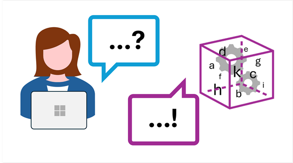

::: zone pivot="video"

>[!VIDEO https://learn-video.azurefd.net/vod/player?id=7284116f-533c-47f7-8d0f-7a3328df7ea8]

> [!NOTE]
> See the **Text and images** tab for more details!

::: zone-end

::: zone pivot="text"

*Generative AI* is a branch of AI that enables software applications to generate new content; often natural language dialogs, but also images, video, code, and other formats. The ability to generate content is based on a *language model*, which has been trained with huge volumes of data - often documents from the Internet or other public sources of information.

Users interact with generative AI language models through *prompts* - natural language statements of questions. The language model in a generative AI solution uses the prompt to initiate the generation of a meaningful response.

Generative AI models encapsulate *semantic* relationships between language elements (that's a fancy way of saying that the models "know" how words relate to one another), and that's what enables them to generate a meaningful sequence of text.

There are *large language models* (LLMs) and *small language models* (SLMs) - the difference is based on the volume of data and the number of variables in the model. LLMs are powerful and generalize well, but can be more costly to train and use. SLMs tend to work well in scenarios that are more focused on specific topic areas or that require easily deployed small models for local applications and agents on devices.

## Generative AI scenarios

Common uses of generative AI include:

- Implementing AI *agents* that assist human users by providing information or automating tasks.
- Creating new documents or other content (often as a starting point for further iterative development)
- Automated translation of text between languages.
- Summarizing or explaining complex documents.

::: zone-end