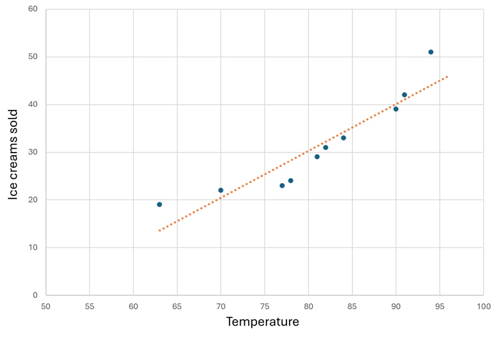

Machine Learning is the foundation for most AI solutions. Since the 1950's, researchers, often known as *data scientists*, have worked on different approaches to AI. Most modern applications of AI have their origins in machine learning, a branch of AI that combines computer science and mathematics.

Let's start by looking at a real-world example of how machine learning can be used to solve a difficult problem.

Sustainable farming techniques are essential to maximize food production while protecting a fragile environment. *The Yield*, an agricultural technology company based in Australia, uses sensors, data, and machine learning to help farmers make informed decisions related to weather, soil, and plant conditions.

View the following video to learn more.

>[!VIDEO https://www.microsoft.com/videoplayer/embed/RE4voJG]

## How machine learning works

So how do machines learn?

The answer is, from data. In today's world, we create huge volumes of data as we go about our everyday lives. From the text messages, emails, and social media posts we send to the photographs and videos we take on our phones, we generate massive amounts of information. More data still is created by millions of sensors in our homes, cars, cities, public transport infrastructure, and factories.

Data scientists can use all of that data to train machine learning models that can make predictions and inferences based on the relationships they find in the data. 

Machine learning models try to capture the relationship between data. For example, you might have daily temperature data and data on units of ice cream a store sells in a day. A simple model that captures some of this relationship can be visualized as a regression line (in red in the graph). The model allows you to predict ice cream unit sales per day based on temperature.  

 

Approaches to AI have advanced to complete tasks of much greater complexity. **Deep learning** developed as a subset of machine learning to address complex tasks using layers of algorithms. These complex models form the basis of AI capabilities.

## Machine learning in Microsoft Azure

Microsoft Azure provides the **Azure Machine Learning** service - a cloud-based platform for creating, managing, and publishing machine learning models. **Azure Machine Learning Studio** offers multiple authoring experiences depending on the type of project such as:
- **Automated machine learning**: this feature enables non-experts to quickly create an effective machine learning model from data.
- **Azure Machine Learning designer**: a graphical interface enabling no-code development of machine learning solutions.
- **Data metric visualization**: analyze and optimize your experiments with visualization.
- **Notebooks**: write and run your own code in managed Jupyter Notebook servers that are directly integrated in the studio.