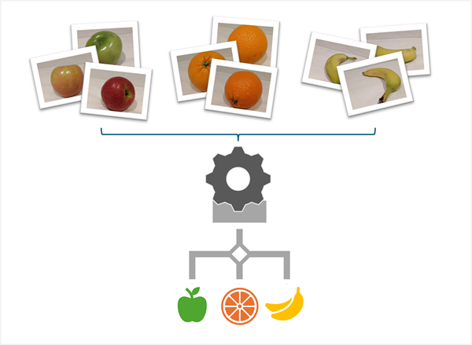

::: zone pivot="video"

>[!VIDEO https://learn-video.azurefd.net/vod/player?id=6bddab82-350b-4420-a1f3-741b9741c7b1]

> [!NOTE]
> See the **Text and images** tab for more details!

::: zone-end

::: zone pivot="text"

*Computer vision* is the area of artificial intelligence that deals with the analysis of visual input; such as photographs, videos, and live camera feeds. Computer vision is accomplished by using large numbers of images to train a model.

There are multiple types of computer vision model.

- *Image classification* is a form of computer vision in which a model is trained with images that are labeled with the main subject of the image (in other words, what it's an image *of*) so that it can analyze unlabeled images and predict the most appropriate label - identifying the subject of the image.
- *Object detection* is a form of computer vision in which the model is trained to identify the location of specific objects in an image.
- *Semantic segmentation* is an advanced form of object detection where, rather than indicate an object's location by drawing a box around it, the model can identify the individual pixels in the image that belong to a particular object.
- *Multi-modal* models combine visual features and associated text descriptions, enabling them to generate comprehensive descriptions of images.

## Computer vision scenarios

Common uses of computer vision include:

- Ai agents that can interpret visual input.
- Auto-captioning or tag-generation for photographs.
- Visual search.
- Monitoring stock levels or identifying items for checkout in retail scenarios.
- Security video monitoring.
- Authentication through facial recognition.
- Robotics and self-driving vehicles.

::: zone-end