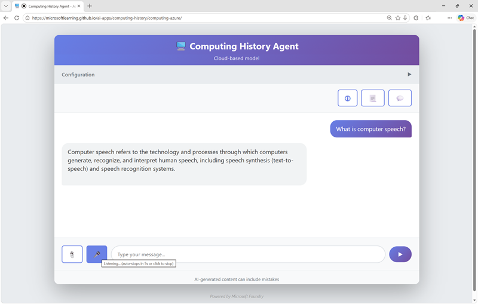
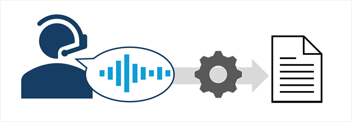
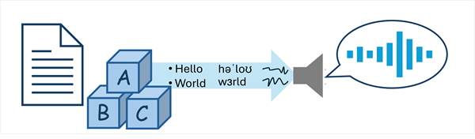

::: zone pivot="video"

>[!VIDEO https://learn-video.azurefd.net/vod/player?id=1918c910-7b6e-4e7a-854a-033223beb325]

> [!NOTE]
> See the **Text and images** tab for more details!

::: zone-end

::: zone pivot="text"

*Speech* capabilities in AI applications and agents enable users to interact with them through spoken language.

For example, our computing history site could include a microphone button that allows users to ask questions verbally, and respond by synthesizing spoken answers.

## Speech recognition

*Speech recognition* is the ability of AI to "hear" and interpret speech. Usually this capability takes the form of *speech-to-text* (where the audio signal for the speech is transcribed into text).

## Speech synthesis

*Speech synthesis* is the ability of AI to vocalize words as spoken language. Usually this capability takes the form of *text-to-speech* in which information in text format is converted into an audible signal.

AI speech technology is evolving rapidly to handle challenges like ignoring background noise, detecting interruptions, and generating increasingly expressive and human-like voices.

## AI speech scenarios

Common uses of AI speech technologies include:

- AI agents that understand spoken input, perform tasks, and respond with spoken results.
- Automated transcription of calls or meetings.
- Automating audio descriptions of video or text.
- Automated speech translation between languages.

::: zone-end
