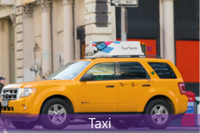
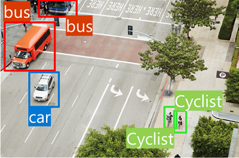
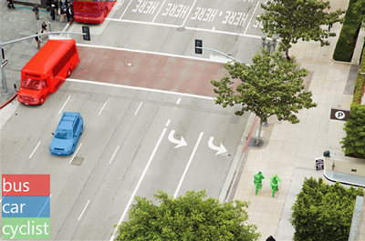
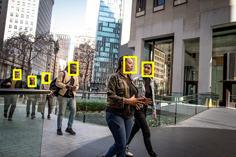

Computer Vision is an area of AI that deals with visual processing. Let's explore some of the possibilities that computer vision brings.

The **Seeing AI** app is a great example of the power of computer vision. Designed for the blind and low vision community, the Seeing AI app harnesses the power of AI to open up the visual world and describe nearby people, text and objects.

View the following video to learn more about Seeing AI.

> [!VIDEO https://www.microsoft.com/videoplayer/embed/RE4vC2Q]

To find out more, check out the [Seeing AI web page](https://www.microsoft.com/ai/seeing-ai).

## Computer Vision models and capabilities

Most computer vision solutions are based on machine learning models that can be applied to visual input from cameras, videos, or images. The following table describes common computer vision tasks.

| Task | Description |
| ---- | ----------- |
| Image classification |   Image classification involves training a machine learning model to classify images based on their contents. For example, in a traffic monitoring solution you might use an image classification model to classify images based on the type of vehicle they contain, such as taxis, buses, cyclists, and so on. |
| Object detection|   Object detection machine learning models are trained to classify individual objects within an image, and identify their location with a bounding box. For example, a traffic monitoring solution might use object detection to identify the location of different classes of vehicle. |
| Semantic segmentation|   Semantic segmentation is an advanced machine learning technique in which individual pixels in the image are classified according to the object to which they belong. For example, a traffic monitoring solution might overlay traffic images with "mask" layers to highlight different vehicles using specific colors. |
| Image analysis|   You can create solutions that combine machine learning models with advanced image analysis techniques to extract information from images, including "tags" that could help catalog the image or even descriptive captions that summarize the scene shown in the image. |
| Face detection, analysis, and recognition|   Face detection is a specialized form of object detection that locates human faces in an image. This can be combined with classification and facial geometry analysis techniques to recognize individuals based on their facial features. |
| Optical character recognition (OCR)|   Optical character recognition is a technique used to detect and read text in images. You can use OCR to read text in photographs (for example, road signs or store fronts) or to extract information from scanned documents such as letters, invoices, or forms. |

## Computer vision services in Microsoft Azure

Microsoft Azure provides the following Azure AI services to help you create computer vision solutions:

| Service | Capabilities |
| ------- | ------------ |
| **Azure AI Vision** | You can use this service to analyze images and video, and extract descriptions, tags, objects, and text.|
| **Azure AI Custom Vision** | Use this service to train custom image classification and object detection models using your own images.|
| **Azure AI Face** | The Azure AI Face service enables you to build face detection and facial recognition solutions.|
| **Azure AI Document Intelligence** | Use this service to extract information from scanned forms and documents.|

