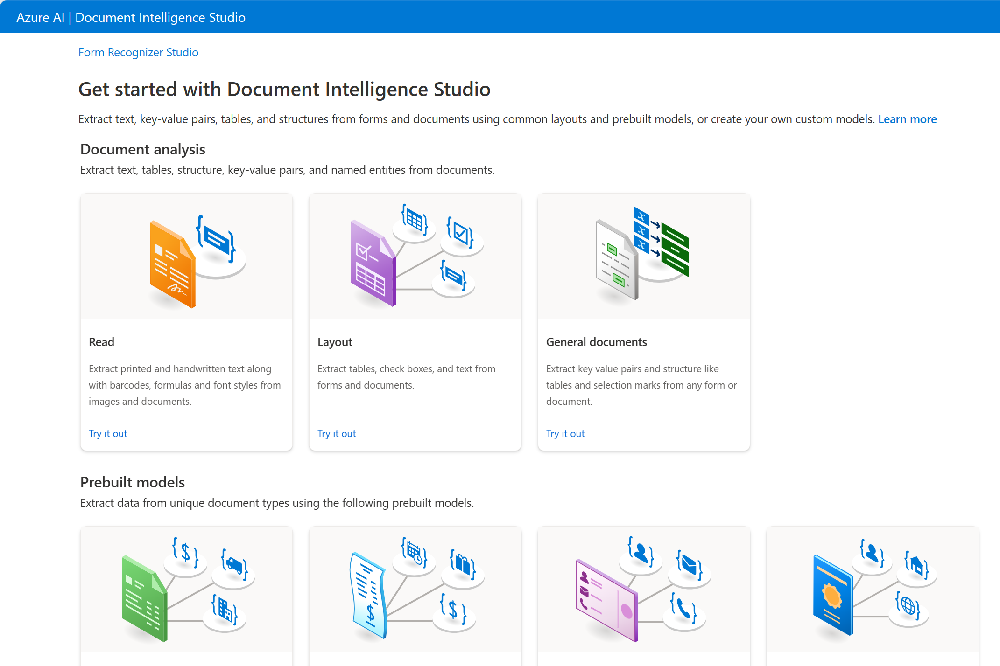

**Document Intelligence** is the area of AI that deals with managing, processing, and using high volumes of a variety of data found in forms and documents. Document intelligence enables you to create software that can automate processing for contracts, health documents, financial forms and more

## Document intelligence in Microsoft Azure

You can use Microsoft's **Azure AI Document Intelligence** to build solutions that manage and accelerate data collection from scanned documents. Features of Azure AI Document Intelligence help automate document processing in applications and workflows, enhance data-driven strategies, and enrich document search capabilities. You can use prebuilt models to add intelligent document processing for invoices, receipts, health insurance cards, tax forms, and more. You can also use Azure AI Document Intelligence to create custom models with your own labeled datasets. The service features are available for use and testing in the **Document Intelligence Studio** and other programming languages.

  

## Knowledge Mining 

**Knowledge mining** is the term used to describe solutions that involve extracting information from large volumes of often unstructured data to create a searchable knowledge store. 

## Knowledge mining in Microsoft Azure

One Microsoft knowledge mining solution is **Azure AI Search**, a private, enterprise, search solution that has tools for building indexes. The indexes can then be used for internal only use, or to enable searchable content on public facing internet assets. 

Azure AI Search can utilize the built-in AI capabilities of Azure AI services such as image processing, document intelligence, and natural language processing to extract data. The product's AI capabilities makes it possible to index previously unsearchable documents and to extract and surface insights from large amounts of data quickly.
