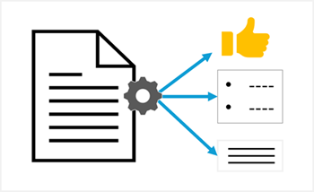

::: zone pivot="video"

>[!VIDEO https://learn-video.azurefd.net/vod/player?id=b0aec446-97a1-4d66-a0ae-a67014e40937]

> [!NOTE]
> See the **Text and images** tab for more details!

::: zone-end

::: zone pivot="text"

Natural language processing (NLP) is a broad term that covers AI models and techniques for making sense of language. NLP is the foundation on which generative AI large language models (LLMs) are built.

While many natural language processing scenarios are handled by generative AI models today, there are common text analysis use cases where simpler NLP language models can be more cost-effective.

- *Text classification* - assigning document to a specific category; including *sentiment analysis* to determine whether a body of text is positive, negative, or neutral.
- *Key-term extraction* and *entity detection* - identifying key words or phrases in a document, and finding mentions of entities like people, places, organizations.
- *Summarization* - Reducing the volume of text while still encapsulating the main points.

## Text analysis scenarios

Common uses of NLP technologies for text analysis include:

- Analyzing document or transcripts of calls and meetings to determine key subjects and identify specific mentions of people, places, organizations, products, or other entities.
- Analyzing social media posts, product reviews, or articles to evaluate sentiment and opinion.
- Implementing chatbots that can answer frequently asked questions or orchestrate predictable conversational dialogs that don't require the complexity of generative AI.

::: zone-end

