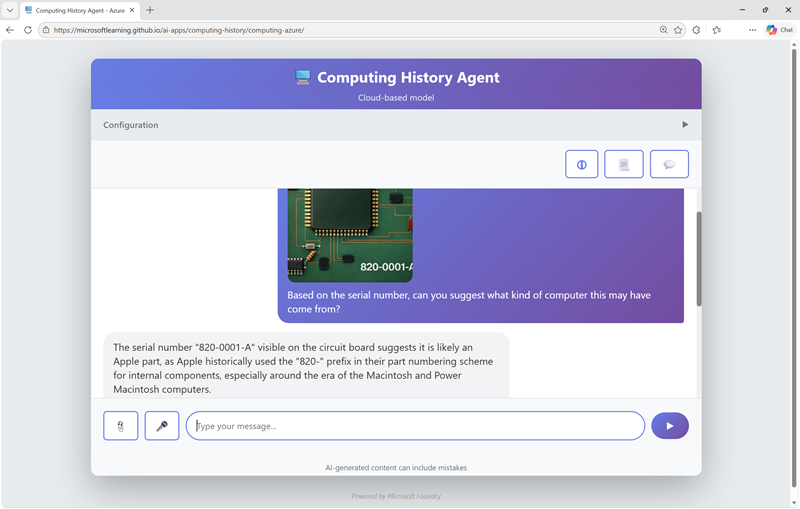
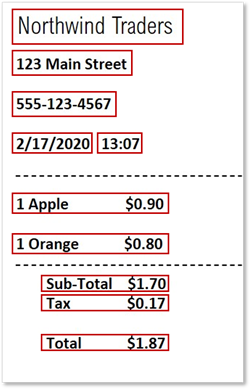

::: zone pivot="video"

>[!VIDEO https://learn-video.azurefd.net/vod/player?id=3d169441-2abe-40d4-b017-561573153b0f]

> [!NOTE]
> See the **Text and images** tab for more details!

::: zone-end

::: zone pivot="text"

AI is commonly used to automate *information extraction* solutions that find information and unlock insights in unstructured data sources, such as scanned documents and forms, images, and audio or video recordings.

For example, we could extend the computer vision capabilities of the computing history application to extract serial numbers and other text from images of computer components and use the information to identify the source computer.

## How does information extraction work?

The basis for most document analysis solutions is a computer vision technology called *optical character recognition* (OCR), which can identify the location of text in an image. OCR is often combined with an analytical model that can *interpret* individual values in the document, and so extract specific fields. For example, to match text extracted from a receipt to fields in an expense claim submission.

While most data extraction models have historically focused on extracting fields from text-based forms, more advanced models that can extract information from audio recording, images, and videos are becoming more readily available.

## Data and insight extraction scenarios

Common uses of AI to extract data and insights include:

- Automated processing of forms and other documents in a business process - for example, processing an expense claim.
- Large-scale digitization of data from paper forms. For example, scanning and archiving census records.
- Indexing documents for search.
- Identifying key points and follow-up actions from meeting transcripts or recordings.

::: zone-end
