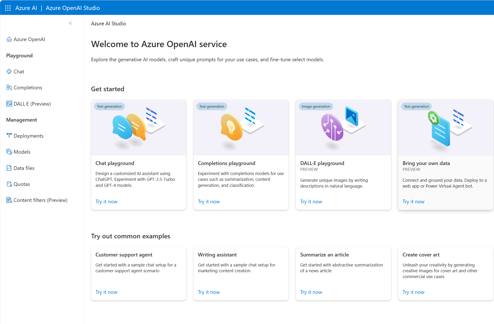

Generative AI describes a category of capabilities within AI that create original content. People typically interact with generative AI that has been built into chat applications. Generative AI applications take in natural language input, and return appropriate responses in a variety of formats including natural language, image, code, and audio.

## Generative AI in Microsoft Azure

**Azure OpenAI Service** is Microsoft's cloud solution for deploying, customizing, and hosting generative AI models. It brings together the best of OpenAI's cutting edge models and APIs with the security and scalability of the Azure cloud platform.

Azure OpenAI Service supports many generative model choices that can serve different needs. You can use **Azure AI Studio** to create generative AI solutions, such as custom *copilot* chat-based assistants that use Azure OpenAI Service models

In this example, an Azure OpenAI Service model is used to power a copilot application that can be used to generate original content in response to user *prompts*, such as a request to write a cover letter.

> [!TIP]
> Learn how a large manufacturing company uses Azure OpenAI to foster better communication and collaboration in this [case study](https://go.microsoft.com/fwlink/?linkid=2266809&azure-portal=true)