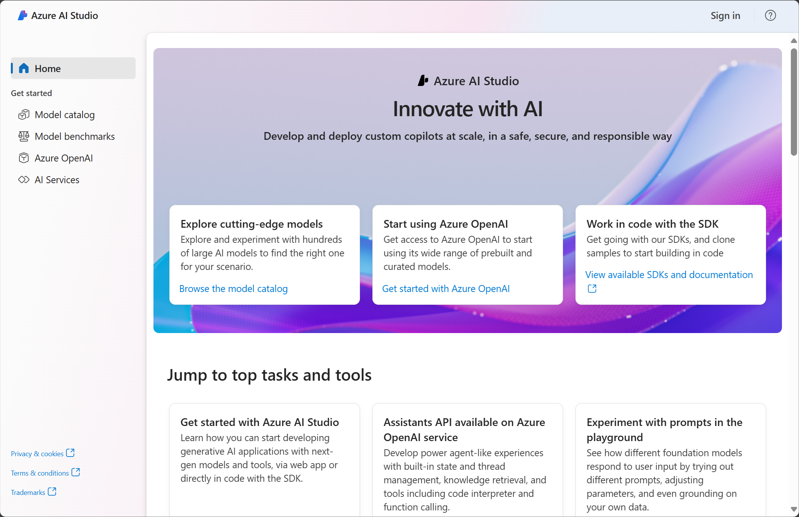

Generative AI describes a category of capabilities within AI that create original content. People typically interact with generative AI that has been built into chat applications. Generative AI applications take in natural language input, and return appropriate responses in a variety of formats including natural language, image, code, and audio.

## Generative AI in Microsoft Azure

In Microsoft Azure, you can use the **Azure OpenAI service** to build generative AI solutions. Azure OpenAI Service is Microsoft's cloud solution for deploying, customizing, and hosting generative AI models. It brings together the best of OpenAI's cutting edge models and APIs with the security and scalability of the Azure cloud platform. 

Azure OpenAI supports many foundation model choices that can serve different needs. The service features are available for use and testing in the **Azure AI Studio** and other programming languages. You can use the Azure AI Studio user interface to manage, develop, and customize generative AI models.

