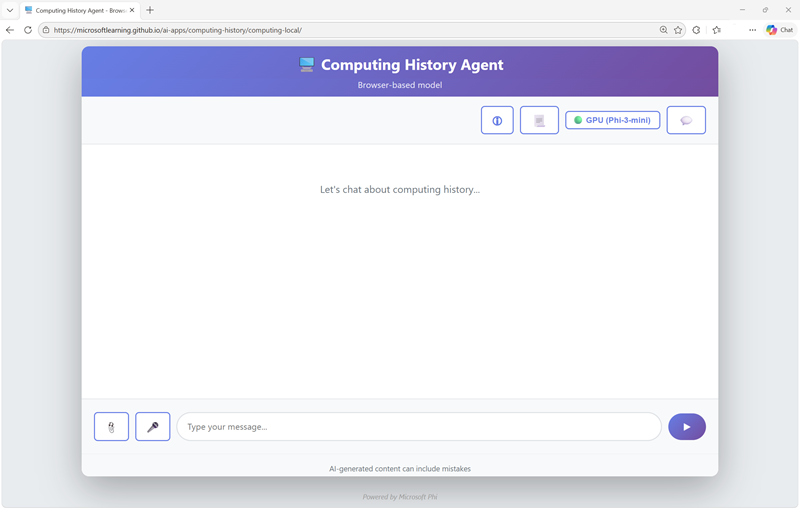

You've learned a lot about AI, and the kinds of things it can do. Now it's your turn! In this exercise, you explore the computing history application we've discussed in this module, and experience the AI workloads it supports for yourself.

*Use the following button to start the exercise*

