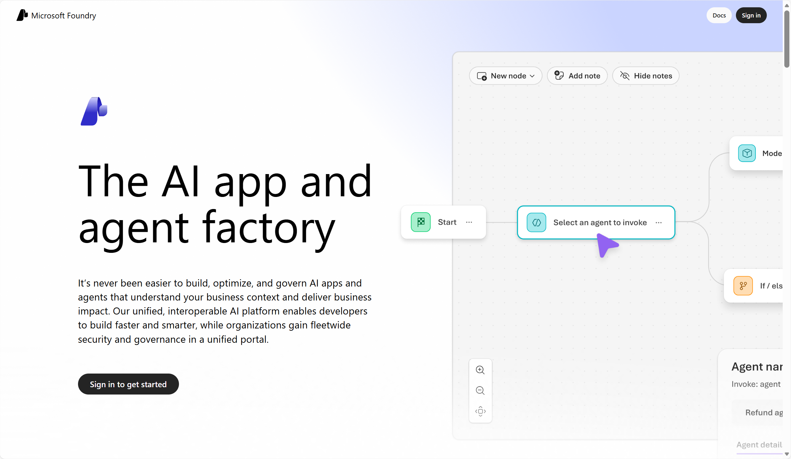
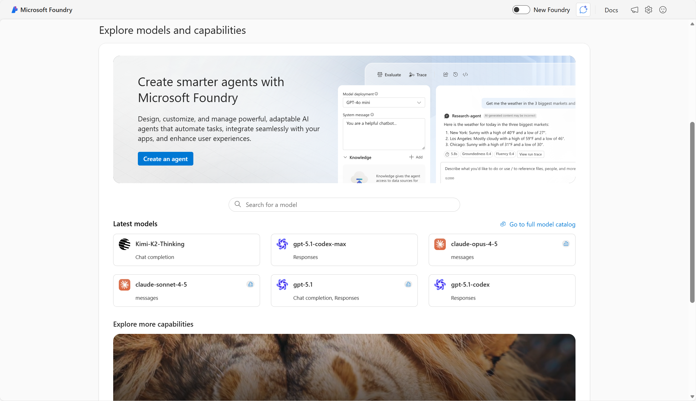

**Microsoft Foundry** is a unified, enterprise-grade platform for building, deploying, and managing AI applications and agents. It consolidates models, agent orchestration, monitoring, and governance tools in one platform, offering production-grade infrastructure and security. With Foundry, developers can seamlessly design, customize, and scale generative AI applications using a rich portal experience or integrated SDKs, without worrying about underlying infrastructure complexities.

Within Foundry's portal, you can work with:

- **Foundry Models**: Access to foundation and partner models (Azure OpenAI in Foundry Models, Anthropic, Cohere, etc.).
- **Agent Service**: Build and orchestrate multi-step AI workflows.
- **Foundry Tools**: Prebuilt Azure services (Vision, Language, Search, Document Intelligence).
- **Governance & Observability capabilities**: Centralized identity, policy, and monitoring for AI workloads. 

## Foundry Models
Foundry supports thousands of models from first-party and diverse third-party providers—including Azure OpenAI in Foundry Models like gpt-4, gpt-5 series, multimodal variants, as well as open-source options such as Meta Llama and Mistral. Enterprise organizations can deploy and manage models directly from Foundry’s model catalog. Foundry offers the ability to test and customize models in a playground setting, deploy models as agents, and manage lifecycle needs, region-specific deployment, and model version control. 

## Agent Service
At the core of  Foundry is the Agent Service for building production-ready AI agents that autonomously make decisions, call external tools, and automate workflows. It abstracts orchestration, thread management, tool invocation, and embeds governance such as content safety and observability. Developers can create low-code or code-first multi-agent systems that interact with documents, databases, or other services through various methods and built-in integrations like Azure Functions and Fabric. 

## Foundry Tools
Foundry offers a comprehensive suite of Azure services—such as speech, vision, language, document intelligence, content safety, and embeddings—accessible via portal, APIs, or SDKs. These Foundry Tools provide AI capabilities that can be built into web or mobile applications in a way that’s straightforward to implement. There're over a dozen different services that can be used separately or together to add AI power to applications. For example, you could use Azure Vision to analyze images, Azure Language to summarize text, classify information, or extract key phrases, and Azure Speech to convert speech to text and text to speech. 

## Governance and Observability 
Governance ensures responsible AI development through compliance, identity management, and risk mitigation, while Observability delivers end-to-end visibility for performance, safety, and operational efficiency—helping organizations deploy AI confidently and at scale. Foundry embeds governance into the AI development lifecycle to ensure transparency, accountability, compliance, and security at scale. Specifically, Foundry provides a unified dashboard for metrics on performance, quality, and safety, lifecycle monitoring, and continuous feedback loops. 

Next, learn how to get started with a project in Foundry. 