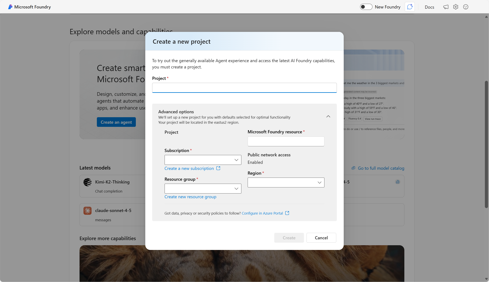

To get started with Foundry after you sign in using your Azure subscription, you need to create a space to do your development work. This space is known as a **project**. A project is the primary workspace for building AI applications and agents. 

Creating a Foundry project means that within your Azure subscription, you have a resource group, and within the resource group, you have a Microsoft Foundry resource that is deployed in the region specified. 

Once you create a Foundry project, you can access:

- The model catalog (foundation and partner models)
- Playgrounds for testing models
- Tools for deploying models, running evaluations, and creating agents
- A Management Center for user roles, quotas, and resource connections

With a project, developers can experiment in playgrounds, deploy models and integrate them via SDKs or APIs, and 
build and test agentic workflows with observability and Responsible AI features.

Choose Foundry project when you need the latest agents, evaluations, and model catalog with minimal Azure setup. You may also want to use other capabilities within Foundry, including services like Azure Language, Azure Speech, Azure Vision, and more. To access other capabilities, create a Hub in addition to a project. 

## Characteristics of Foundry offerings

Foundry models and tools are based on principles that dramatically improve speed-to-market:
1.	Prebuilt and ready to use or customize
2.	Accessed through APIs
3.	Available on Azure

#### Prebuilt and ready to use
AI has been prohibitive for all but the largest technology companies because of several factors, including the large amounts of data required to train models, the massive amount of computing power needed, and the budget to hire specialist programmers. Foundry makes AI accessible to businesses of all sizes by using pretrained machine learning models to deliver AI as a service. Foundry uses high-performance Azure computing to deploy advanced AI models, making decades of research available to developers of all skill levels.

#### Accessed through APIs
Foundry models and tools can be built into applications with APIs. Secure communication with APIs is possible through *authentication*, the process of verifying that the user or service is who they say they are, and that they're authorized to use the service. 

Part of what an API does is to handle authentication. Whenever a request is made to use a Foundry resource, that request must be authenticated. For example, your subscription and AI service resource is verified to ensure you have sufficient permissions to access it. This authentication process uses a resource *key* and an *endpoint*. The key is a secret password that the app uses to prove its identity when talking to another service or system.

The endpoint describes how to reach the AI service resource instance that you want to use, in a similar way to the way a URL identifies a web site. When you view the endpoint for your resource, it looks something like:

`https://cognitiveservices48.cognitiveservices.azure.com/`

The resource key protects the privacy of your resource. To ensure your key is always secure, it can be changed periodically. 

When you write code to access the resource, the keys and endpoint must be included in the authentication header. The authentication header sends an authorization key to the service to confirm that the application can use the resource. 

Next, learn about how Foundry models and tools are available on Azure. 
